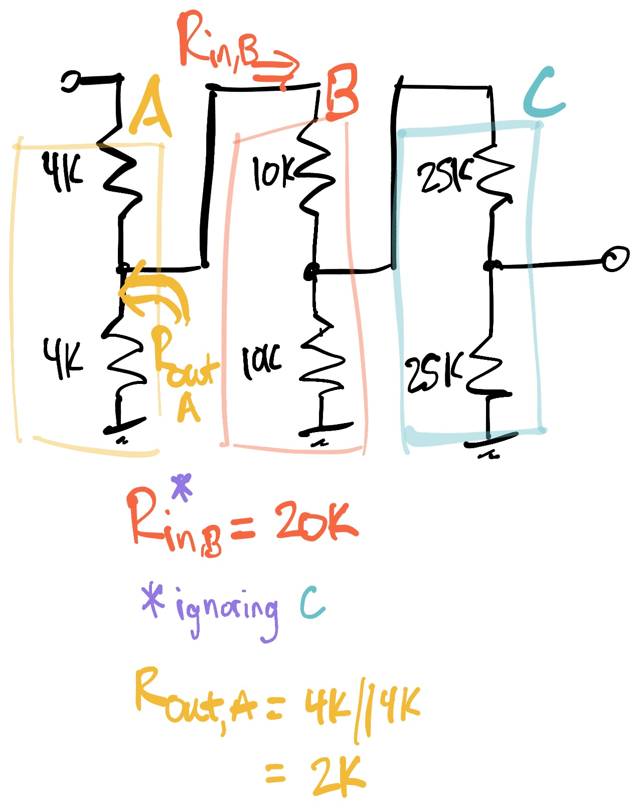
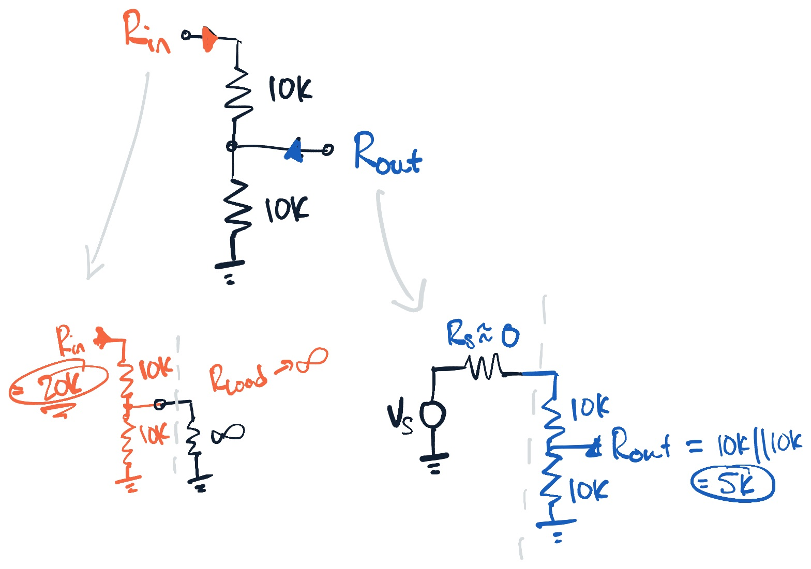
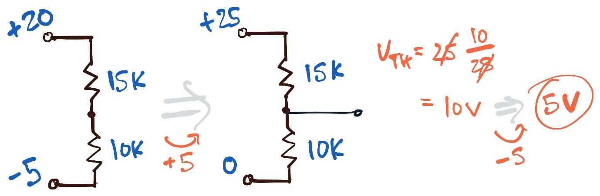
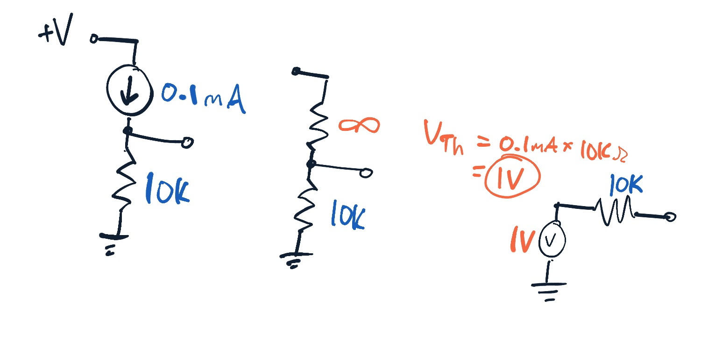
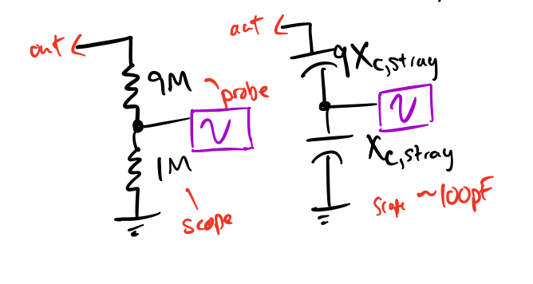

parent:: [[215-LAoE]]
garden-topic:: [[Input and Output Impedances]], [[Measurements. Scopes and Probes]]
next::[[02-RC-Circuits✅]]

Summary:: Input and output impedances, Ideal Sources and Loads; Error introduced by measurement devices; Voltages or currents as signals; Current source as a high output impedance, Voltage source as zero output impedance; Scope probe design - use 10x impedance probes to avoid overwhelming affect of high Xc at high frequencies (Xc ~= 1/C)  - implemented using two sets of voltage dividers (one resistive, one capacitive); ideal measurement device has infinite impedance
# Input and Output Impedances

 Design Rule of Thumb^[only works for voltage sources and low frequencies where we can ignore T-line effects] : [[Output impedance of the supply circuit should be less than 10 pct of the load circuit input impedance]]
- **[[Output impedance of the supply circuit should be less than 10 pct of the load circuit input impedance]]** ($Z_{out} \le Z_{in}/10$) 

An ideal source drops no voltage, thus $Z_{out,src,ideal}=0$
- The output impedance is looking *back into* the source, it is what the load sees
- *Note*: to get the output or *thevenin* impedance we short the output terminals to ground (thus usually paralleling components)

An ideal load drops all the voltage, thus $Z_{in,load,ideal}=\infty$
- The input impedance is looking into the load with the input terminals open (disregarding the source)

# Looking Through Source and Load Impedances

What about voltage sources for input impedances? See [[03-Diode-Circuits]] Worked Example 3. 

We can assume **source impedances are negligible when determining the output impedance**. Likewise we can assume **load impedance is infinite when determining input impedance **.  [[Example - Looking Through Input or Output Impedances]]

# Measurement Errors

Placing a voltmeter and ammeter in a circuit. 
When we place a voltmeter or ammeter in the circuit we will introduce error. Either we will be measuring the current in the load plus that required by the voltmeter to deflect or we will be measuring the voltage of the load plus that over the internal resistance of the voltmeter.  ^bfcao3
- [[Example - Error Introduced When Measuring With Voltmeter or Ammeter]]

# Signals as Voltages or Currents

For a **voltage** to be used as a signal we need to drop most of the voltage across the output terminals 
For a **current** to be used as a signal we need the load circuitry to be near 0 impedance. 
For **power** to be used as signal the output impedance and the load impedance gives [[Maximum Power Transfer]].  

For signals as voltage we use decibels as $$dB = 20log\frac{A_2}{A_1}$$
# More Complicated Thevenin Models

For dual supply voltages, we can shift both voltages so that one is at 0V reference. Calculate the thevenin voltage as normal and then *shift back* for the final answer. Thevenin impedance will not be affected (we "short circuit" voltage sources). 

An ideal current source has an infinite output impedance. #anki-todo  Infinite current source impedance means that the current does not change if a larger load is applied - the current source impedance dwarfs any load impedance. 

An ideal voltage source has zero output impedance #anki-todo 

Current sources show a very high output impedance, thus we can replace them with $\infty$ or *open circuit* them. 
- Take $Z=\frac{\Delta V}{\Delta I}$ as $\Delta V \rightarrow \infty$ and $I$ stays constant due to being a source; $\therefore Z \rightarrow \infty$

# Scope Probe Design

The scope can be seen as a 1M$\Omega$ resistor and a parallel stray capacitance to ground. [[Scope Input Impedance Acts as Lowpass at High Frequencies]] - the capacitance to ground of the scope plus 3 feet of BNC cable in the order of 100pF creates a burden (read: low impedance) at high frequencies (@1MHz, Xc = 1.6kOhms) -- disastrously low especially at high source impedances. This can result in attenuation and oscillation (esp. for amplifiers). Thus *we almost always use 10x probes with scopes*. 

At higher frequencies we want to decrease the affect of the capacitance so we use a "10X" probe, which results in 10 times the impedance of the scope's internal impedance. We cannot just put a 9MOhm resistor in series, since this just creates a low pass filter with the stray capacitance. 

The remedy is to use two voltage dividers, one resistive and one capacitive, in parallel so that at low frequencies the R divider dominates and at high frequencies the C divider dominates. If we make sure each divider's proportion is the same (e.g. 1/10 Vin) then it will also work for the in-between frequencies. In practice we make one of the capacitors variable so that we can tune it for the particular stray C of each oscilloscope. See [[Measurements. Scopes and Probes]]

# Advanced Measurements
We will see in the labs how the scope can act as a lowpass RC filter when measuring circuits. 

The ideal measurement device has infinite impedance? #anki-todo 

The ideal measurement device has infinite impedance. But this is prohibitevly expensive at higher frequencies. Scopes usually have 1M$\Omega$ impedance, but at high frequencies capacitive reactance dominates -- here we can use a pre-amplifier or differential input to decrease noise. At UHF we need to use a 50$\Omega$ terminator to match the transmission line impedances ($X_C$ and $X_L$ of the line). 
