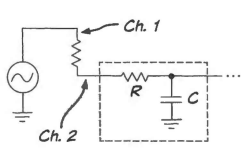
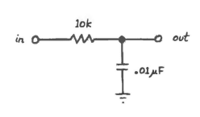
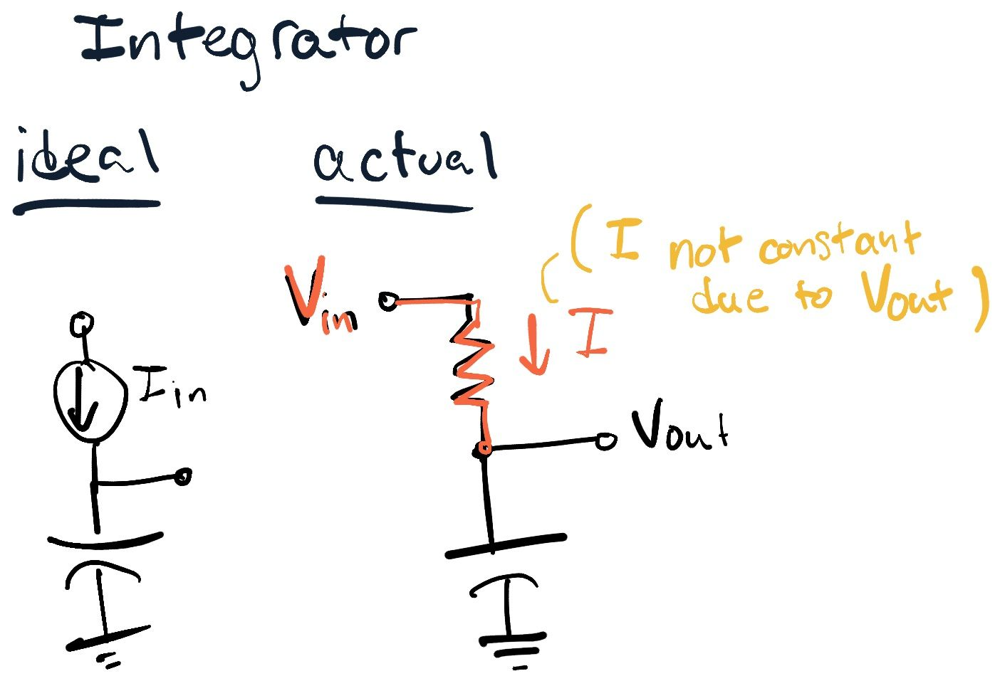
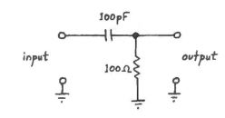

parent::[[02-RC-Circuits✅]]

## Summary 
1 - Equipment
- **Oscilloscope Specs:** → [[oscilloscope]]
    - Input impedance: 1MΩ.
    - Stray capacitance: Up to $C_{stray} \approx 100pF$→  `f0 = 1/(2*pi*1E6*100E-12) = 1600Hz` for the [[RC Filters]]
    - Use 10x probes for better frequency response. → 16kHz
    - Rule of thumb: Measure signals 5x lower in frequency than the scope frequency.
- **Bandwidth Calculation:**
    - Bandwidth calculation formula: $BW = \frac{0.35}{t_r}$.
    - Time response vs. time constant: $t_r = ln(9) \times \tau \approx 2.2 \times \tau$.
- **Things to Watch Out For:**
    - Tolerances propagate in calculations.
    - Output impedance of equipment  < 10x input impedance of the circuit being driven (i.e. we can only accurately measure higher impedance circuits)

2 - Low Pass RC Filter
- **Time View:**
    - Expected time constant ($\tau$): $47\mu s$.
    - Input a 500Hz step wave to find the time constant.
- **Unknown R, C Values:**
    - Determine R by looking at attenuation where there is no phase shift between input and output.
- **Frequency View:**
    - Vary input frequency to observe cutoff frequency point.
    - Attenuation increases sharply after the cutoff frequency.

3 - High Pass
- **Time View:**
    - High-pass mirrors the rising or falling step change.
    - Capacitor blocks DC offsets.
- **Frequency View:**
    - At DC frequencies, output has -90 degrees phase shift and significant attenuation.
    - High pass can act as a differentiator.
- **Requirements for Low Pass as an Integrator:**
    - Small output voltage.
    - High frequency or large C: $\omega RC \gg 1$.

## 1) Equipment
First we need to review our equipment specs. 

The oscilloscope usually has an input impedance of 1M$\Omega$. Remember an ideal voltage meter has infinite impedance so we can measure all of the voltage. But the [[Scope Input Impedance Acts as Lowpass at High Frequencies]] due to the stray capacitances (to ground) in both the cable and internal to the scope. The total can be up to $C_{stray} \approx 100pF$ which creates a lowpass at corner frequency of 1600Hz, which isn't very high. So thereore **we almost always use 10x probes** (_correctly calibrated_) which allows signals to pass at low and high frequencies (up to the designated frequency on the scope).

The rule of thumb for measurements is to measure signals 5x lower in frequency than the scope frequency. So for a 20MHz scope we can measure just 4MHz signals (especially square waves and other signals with high frequency components). 

You can calculate the bandwidth of any circuit response by inputting a step wave and measuring the time it rises from 10 to 90%, or the rise-time $t_r$. Then the BW is:
$$ BW=\frac{0.35}{t_r}$$
#anki-todo 

This comes from $V_{OUT}=V_{IN}(1-e^{t/RC})$ for the [[Low Pass RC Filter]]. 

Also we can derive the time response vs time constant: 
$$ t_r = ln(9) \times \tau \approx 2.2 \times \tau $$
#anki-todo 

1. Calculate the bandwidth of your oscilloscope and probe with the formula above.
#### Things to Watch Out For

**Tolerances Propagate**
Our tolerances propagate. When calculating $\tau=RC$ with a 10% resistor and a 20% capacitor the worst case low value is $90\% \times 80\%=72\%$. The worst case high value is $110\% \times 120\%=132\%$. So we can approximately add the errors for a total error of $\pm 30\%$, which is pretty high. 

**A Small R will Overload the Function Generator**
It is important to know the output impedances of your equipment to meet the [[Output impedance of the supply circuit should be less than 10 pct of the load circuit input impedance]] rule. Some function generators are 50$\Omega$ and some are 600$\Omega$. This 10x difference can result in a circuit working with one AWG but not on another (the input waveform will be distorted). Size the resistor by disregarding the capacitor value. So for a 600$\Omega$ output, the resistor should be >6K. 

## 2) Lowpass RC Filter

Build the lowpass filter with the following:
- R=4K7
- C=0.01uF

### Time View
Note the tolerances for your device (see [[List of Device Markings]].) What is the expected time constant $\tau$ and frequency?  What would be the 
- $\tau=RC=4.7\times 10^3 \cdot 0.01\times 10^{-6}=47\mu s$

1. **Input a 500Hz step wave and find the time constant.**

At $t=\tau$, where the output is 63.2% of the input, $t=53\mu s$, which is close to the expected. 

Fill out your own table:

| R | C | Expected $\tau$ | Measured $\tau$ |
|---|---|---|---|
| 4.7K$\Omega$| 0.01$\mu$F| 47$\mu$s | 

At a certain point, the frequency is too fast for the capacitor to react, so it does not reach full input high (1V) or input low (0V). 

#todo/img - results with too high or low input frequency

#### Determine Unknown R, C Values of Lowpass

We can determine R by looking at the attenuation where _there is no phase shift between input and output_. If there is no phase shift we can assume the capacitor is not affecting the total impedance ($X_C = \frac{-j}{\omega C} \rightarrow 0$).

We do this by adding a voltage divider in front of the capacitor with a known top resistor value (we are trying to determine the second resistor).

- At DC the capacitor blocks current from flowing to ground. Thus $V_{OUT}=V_{IN}$, which doesn't help us (we need a current to flow for the voltage divider to work). 
- Above 1MHz we cannot ignore the stray capacitance of the probe and scope
- Look for the value between 10-100kHz where the phase difference disappears. The capacitor is "shorted" passing all high frequency components.

Once the R value is determined, we can use $\tau = RC$ and the step response above to find C.

### Frequency View

We can vary the input frequency to see the cutoff frequency point (output at 71% of input). 

The attenuation **increases sharply after the cutoff frequency**.

Phase shift is 0 at low frequencies and +90 degrees (lagging or shift to the right) at high frequencies.

### Aside: Lowpass as an Integrator

$$V_C=\frac{1}{C}\int I(t)dt$$

The ideal integrator is just a current source driving a capacitor, and $V_{OUT}=V_C$ which is the integral of the current. 

Since practically we have to drive current across a resistor with an applied voltage, $I$ won't be constant due to the change in output voltage, i.e. $I=(V_2-V_1)/Z$.

So we must make sure that the voltage across the resistor is nearly constant, which we can do by making $V_{OUT} \ll V_{IN}$.

But we also want to make sure that the capacitor does its job as an integrator (we don't want the exponential response to the input), so we need a **high frequency** or $\omega RC \gg 1$.

**Requirements for Low Pass as an Integrator**
- small output voltage: 
	- $V_{OUT} \ll V_{IN}$
- high frequency or large C: 
	- $\omega RC \gg 1$

## High Pass

### Time View
**Step Response**:
Since in the high pass we are _not_ measuring $V_C$ as the output we will _mirror the rising or falling step change_. Here $V_{OUT} = V_{IN} - V_C$, and we know that the capacitor voltage can't change instantaneously. 

#todo/img highpass response to step

Note how even though we had a DC offset in the step input wave, the output is centered around 0V -- _the  capacitor blocks DC offsets_.

### Frequency View

**Sine Response**:
At DC frequencies the output has a -90 degrees phase shift (leading) and the waveform is greatly attenuated.

**As a Differentiator**:
$$I_C = C \frac{dV}{dt}$$

We can think of the ability to "pass high frequency components" also as differentiation. For the step input, the output is a spike (up or down) - again since the voltage over the capacitor cannot change instantly, the output does. This works if the capacitor can fully charge or discharge quickly to bring the output back down and complete the "spikey"response. 

Practically we cannot measure the current over the capacitor without a resistor. But since we "move" the output away from ground we introduce some error. The error can be minimized if $dV_{OUT}/dt \ll dV_{IN}/dt$ and the time constant is small.
- $dV_{OUT}/dt \ll dV_{IN}/dt$
- $\omega RC \ll 1$

This usually results in **very small values of R and C**, which **will only work at low frequencies** when the vlaue of $Z_C$ is large (so as not to affect the input).

