parent:: [[215-LAoE]]
prev:: [[01-DC-Circuits]]
next:: [[03-Diode-Circuits]]
lab:: [[02-Lab-RC-Circuits✅]]
garden-topic::[[RC Filters]], [[RC Filters]], [[Decibels Summary]], [[Differentiator]]
status:: #status/🟡 

Summary::Capacitor as an integrator, differentiator, departures from ideal; Decibels; RC filter circuits, attenuation, design rules of thumbs; Loading of a filter affecting the cutoff frequency and attenuation

#anki-todo 
Capacitor equations: static, dynamic

# Capacitor Fundamentals

- voltage across a capacitor cannot change instantaneously
- Static: $Q=CV$
- Dynamic:  #anki-todo 
	- $i_c(t)=C\frac{dv_c}{dt}$
	- $v_c(t) = \frac{1}{C} \int i(t) \, dt + v_c(0)$

A constant current applied to a capacitor (e.g. a current source) will result in a linear increase in voltage over time. 

#anki-todo capacitor exponential response

When a constant or DC voltage is applied to a capacitor across a resistor, assuming the cap initially has no charge, will result in the classic $v(t)=V_s(1-e^{-t/RC})$ response where the capacitor voltage asymptotically approaches the applied voltage. #todo proof

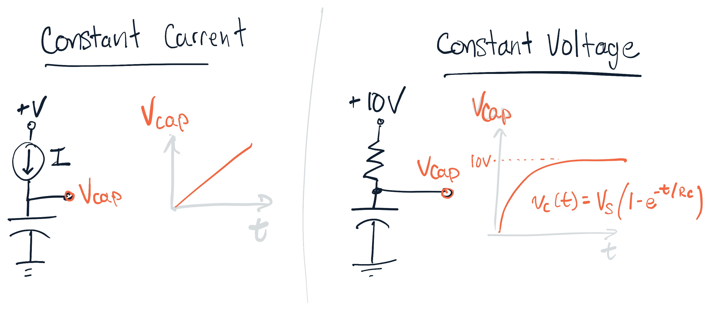

> Q. What happens when you apply the voltage without the resistor?
>   A capacitor won't pass DC voltage/current if there is nothing to "charge through", like the resistor in this case (or conversely, with the capacitor "on top of" the resistor - see [[#Differentiator]]). 

For an [[RC Filters]] after 1 time constant the voltage will approach 63% of the input. After 5 time constants the voltage across the cap will be 99% of the input. 
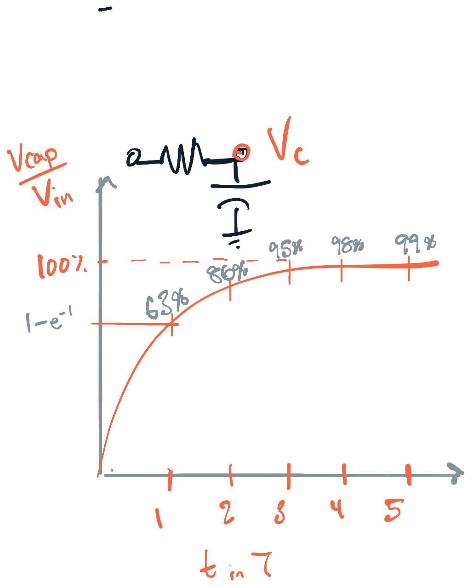

> Tip: $\mu$'s for R and C means the time constant will be in *seconds*. For $k\Omega$ and $\mu F$ the time constant will be in *milliseconds*. 

# Integrator

Integrators are instantiate as low-pass filters (output voltage is taken the same as the capacitor). 

#anki-todo The voltage across the capacitor is the integral of the current + equation

For an applied current, the voltage across the capacitor can be seen as the integral of the capacitor current (clearly seen for the constant I vs V_c graph). This comes directly from 
$$I_c=C\frac{dV}{dt} \Rightarrow \int dV=C\int I dt $$
$$\therefore V= C \int I dt$$
#anki-todo integrator requirements for real - without an ideal current source, if we apply a current through a resistor, we can only acheive a good integrator if the voltage across the capacitor is low (since it will shift the output voltage and thus affect the current supply). We also want to approximate the "linear" slope for the ideal integrator case given a dc input, we do this by not allowing the capacitor to charge for much time, by using a large C value or a small switching time
But since in reality we usually apply a voltage through a resistor this is only the case if the output voltage is much smaller than the input and for $\omega RC >> 1$ (See [[resonant frequency of the RC circuit]] )
- $V_{out} << V_{in}$
- $\omega RC >> 1$
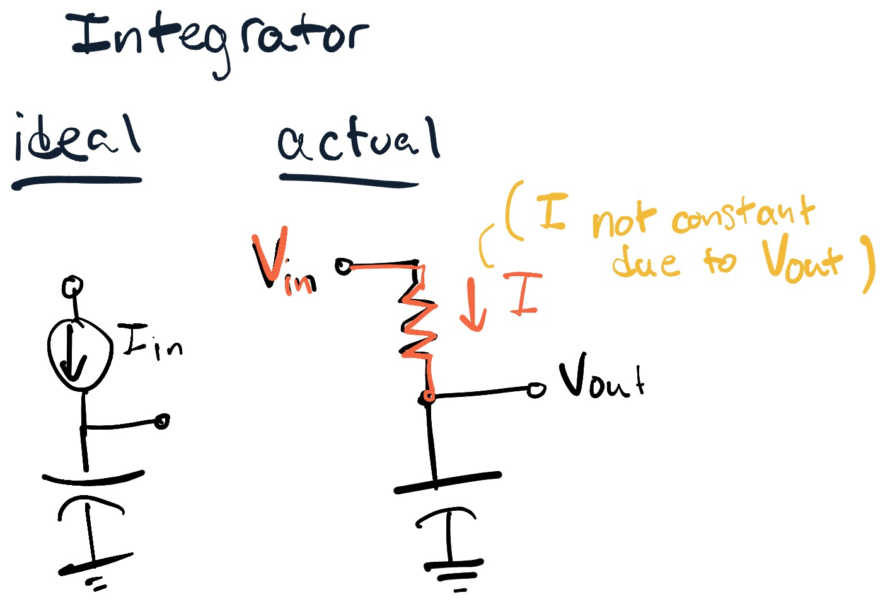

Inspecting the non-ideal case:
- If we squash V_out_, the capacitor doesn't have much time to charge between input reversals (if $RC>> T_{input} /2$)
- Since the capacitor voltage is changing with the applied signal, the current is not constant, and since the current is not constant the integrator is not ideal. This is another reason to squash the output

> Key Point: We have to move the output above ground (adding a resistor) otherwise current won't flow across the capacitor.

You can check this by looking for **the input waveform as the slope of the output**. 

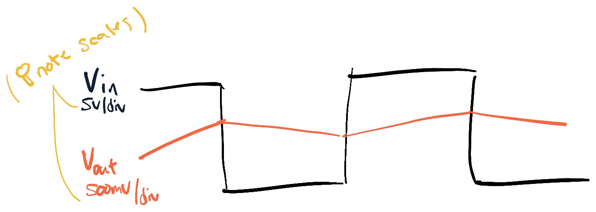

# [[Differentiator]]
Ideal differentiator - here the capacitor is before the output - this makes sense for a rising edge input we get to see the "pulse output" since capacitors pass AC; this is the form of a differentiator #anki-todo 

Here we want to use a small capacitor so that the capacitor charges almost fully instantly, giving us that snappy pulse response; we also need the output resistor to be small since it introduces error #anki-todo 

The ideal differentiator is just a voltage source applied to the capacitor, then the current is proportional to dV/dt ( $I=C dv/dt$). But to get current to flow we need to pass this over a resistor or some load, thus introducing error. The non ideal case approaches the ideal when the voltage change is small (just as in the integrator case that worked if the output was small). 

#q the picture is wrong for the dVc/dt label,this is the current
undefined

When we measure the output across the resistor after the capacitor, we can see that when we initially change the input voltage the output voltage changes instantaneously as well (since the voltage across a capacitor can't change instantaneously). Then as the capacitor responds, "storing" more and more voltage, the output voltage eventually drops back to 0. Thus we get the differentiaton effect, that a positive step voltage input results in a positive spike output (non ideal delta response) across the resistor which is taken as $V_{out}$.

Requirements: $\frac{dV_{out}}{dt}<<\frac{dV_{in}}{dt}$

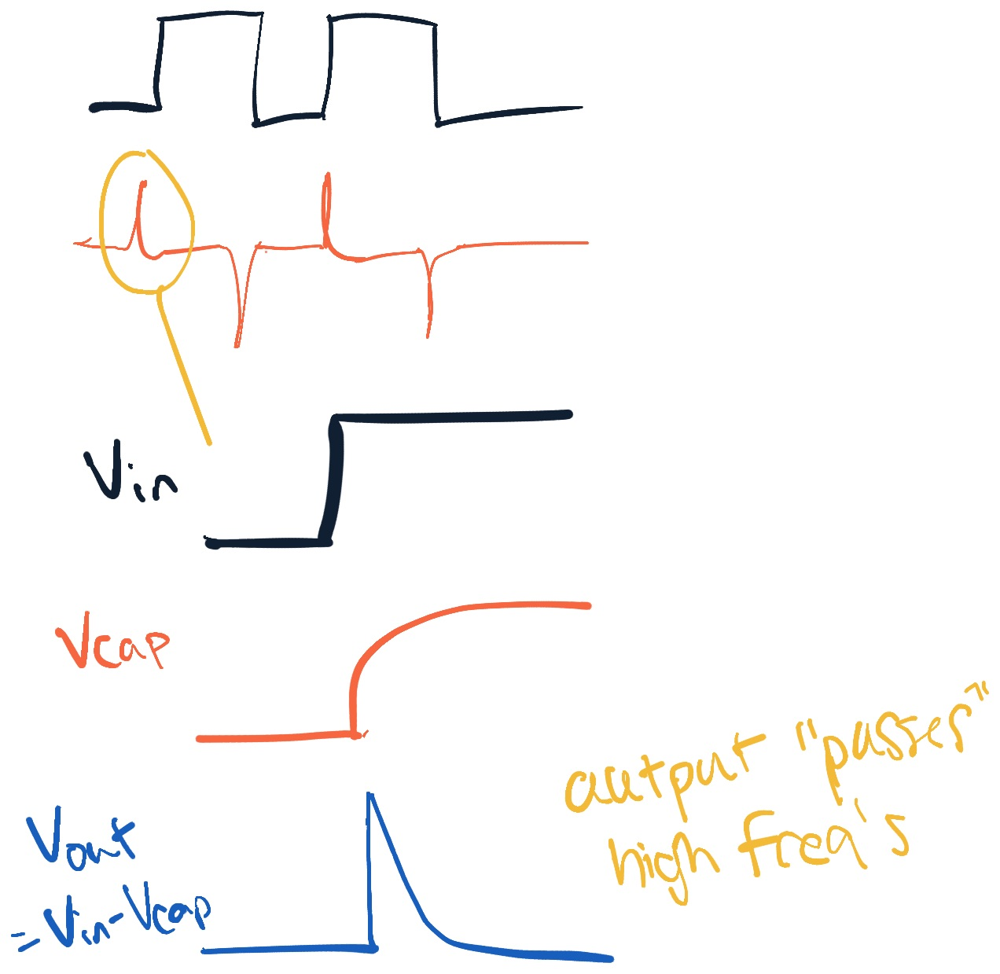

> Note the output also passes the negative going pulse ;→[[RC Differentiator Circuit]]

# Decibels and Log Plots

[[Decibels Summary]]

Power: $dB=10 log(\frac{A_2}{A_1})$
Amplitude: $dB=20log(\frac{A_2}{A_1})$

#anki-todo 
Common values for amplitude:
- output is 70% of input: $\frac{1}{\sqrt{2}}$ => -3dB
- 50% => -6 dB
- 10% => -20dB

> Each increase/decrease by a factor of 10 is an increase/decrease of 20 dB

A inverse decreasing function on a linear scale will look like a linear decreasing function on a log scale. This is useful since many times the amplitude function is something like $\frac{1}{\sqrt{1+\omega / \omega_0}}$. 

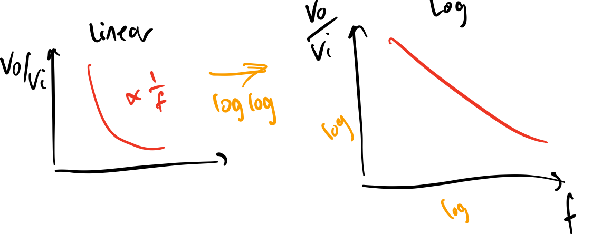

# Frequency View of RC Circuits

See a summary in [[RC Filters]]

**Time domain view**: a time varying voltage across C causes a current to "pass through" a capacitor
**Frequency view**: a capacitor's impedance varies with frequency.

Capacitor impedance is $Z=\frac{-j}{\omega C}$ thus capacitors are a **open circuit** at low (dc) frequencies and **short circuit** at high fequencies. Another way of saying this is "wiggle in, wiggle out".  

> Key Point: Capacitors block low frequencies and pass high frequencies. 

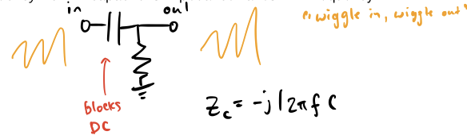

We can configure the capacitor in the circuit to short high frequencies to ground (low pass filter), or to block low frequencies allowing only high frequencies to pass (high pass filter).

## Low Pass RC Filter

A low pass RC filter will *short high frequencies to ground*, thus the capacitor is placed after the resistor and to ground.  #anki-todo 

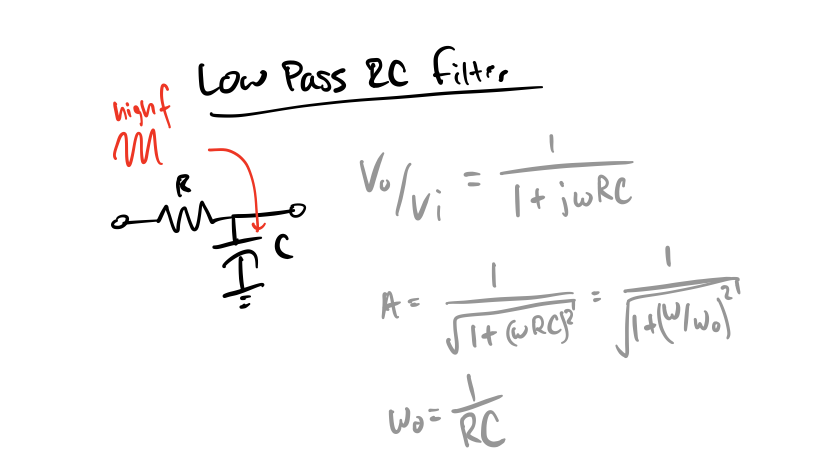

When chaining filters together we need to look at our input and output impedances, whether the filter is being used as a load or a source. For the low pass example see [[Example - Low Pass Input and Output Impedances]]

## High Pass RC Filter

High pass filter attenuation #anki-todo 

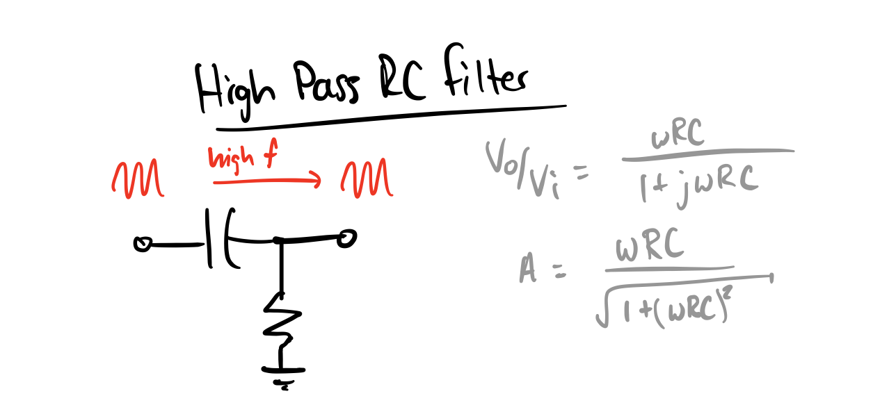

# Rules of Thumb for RC Filter Design

## To Pass, Use 2x Above/Below Cutoff Frequency
#anki-todo  rc filter design criteria
[[RC Filter Design Criteria]]

For <10% attenuation in the **passband** place the cutoff frequency at a factor of 2 above or below the max signal frequency (here we can also ignore phase shift as <25°)
 - Low pass: $f_{signal} \le \cdot \frac{1}{2} f_{3db}$
 - High pass: $f_{signal} \ge 2\cdot f_{3db}$

## Attenuation is Proportional to Frequency in the Stopband

In the stopband, attenuated frequency is proportional to frequency. So, for a low pass filter above the cutoff frequency a 10x increase in $f$ will result in a 10x decrease in signal amplitude.

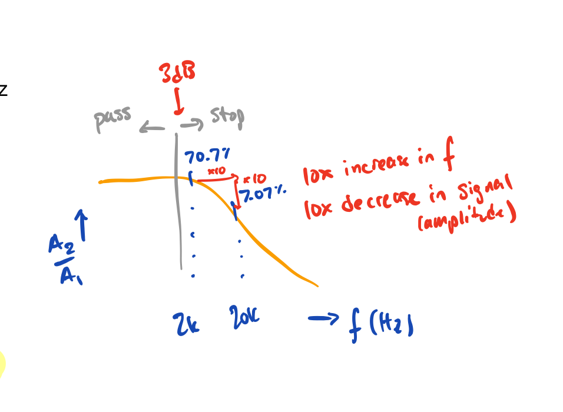

## Small Loads Can Shift $f_{3dB}$
→ [[The effect of loading filter circuits]]
- A large load will attenuate the signal but doesn't shift the filter (remember: [[ideal loads have infinite impedance]] - $Z_{in} \rightarrow \infty$)
- A small load (esp. that approaching the $Z_{in}$ of a filter as a source) will violate the 10x rule and **shift the cutoff frequency**
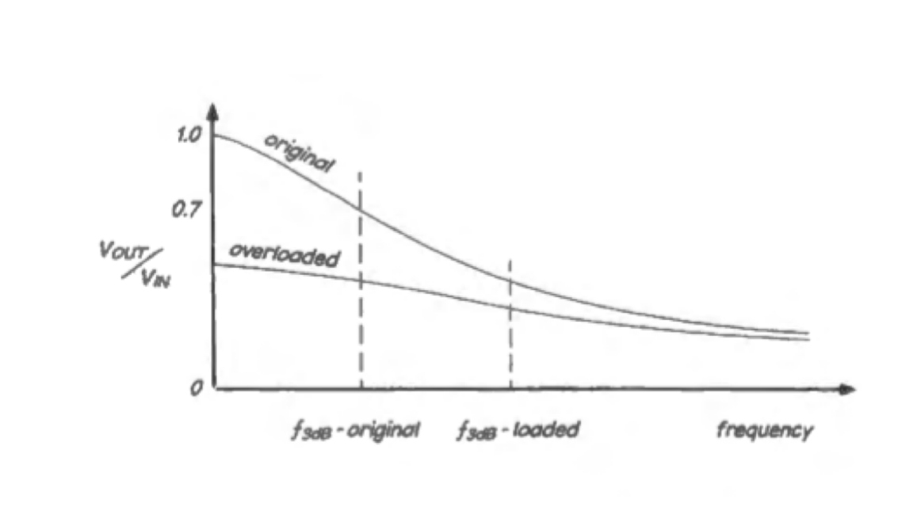

> We can deal with a large load attenuating the filter (with amplfication later) but we cannot get back the excluded frequencies if the load is small s.t. it shifts the cuttoff frequency

---
Next Up: [[03-Diode-Circuits]]

