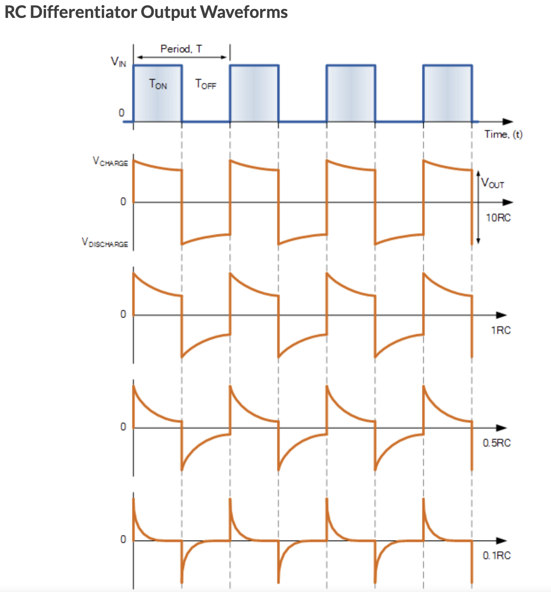
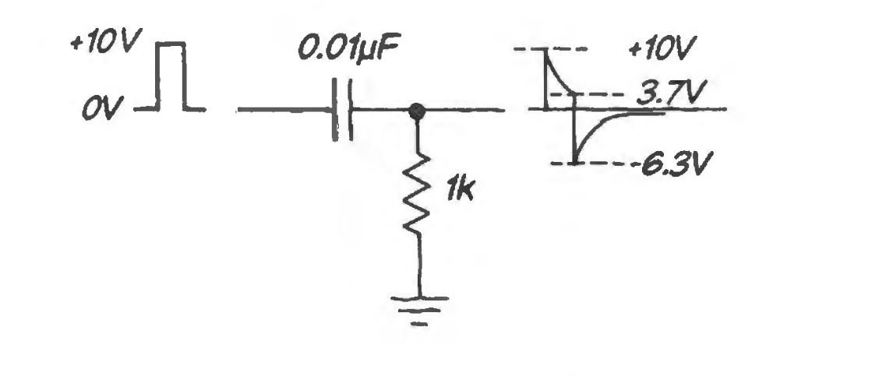

see-also::[[Capacitor Charging-Discharging Equations]]

undefined

> [Source](https://www.electronics-tutorials.ws/rc/rc-differentiator.html)

> ② The input pulse is 10us, and $\tau_{RC}=RC=10\mu s$, so we will see the charge/discharge response of the capacitor as a differentiator. 

**Analysis**
- The capacitor cannot change voltage instantaneously, so the positive edge input +10V appears directly at the output at t=0+. 
- After t=0+ the capacitor starts to charge up through the resistor. The capacitor being charged means the output voltage decreases since $V_{out}=V_{in}-V_{C}$. 
- After 1 RC, the capacitor has charged to 63% (1-1/e), so the output voltage is 10-6.3 - 3.7V
- **Falling edge**: The input now changes from 10V to 0V, the capacitors voltage cannot change instantly so the dV, or -10V, passes through to the output. 
- #tdf - needs drawing - the capcitor at this point has a positive charge on the left plate, as it charges up to the supply we see less of a voltage on the output; once the supply voltage is removed, all that is left is the capacitor, but now it is "reversed" that is, the right plate, with the negative charge, acts as the source, discharging through the resistor. So whatever charge was left on the capacitor plate now is the output #til a better understanding of series capacitor responses
- The output was at 3.7V, so 3.7 - 10 = -6.3V, and the capacitor discharges this negative voltage through the resistor and the output Vo decays to zero (inverted)
Also in [[Example - Capacitor as a Differentiator]]

## References
- ① [RC Differentiator Theory of a Series RC Circuit](https://www.electronics-tutorials.ws/rc/rc-differentiator.html)
- ② [[hayesLearningTheArtOfElectronics2016]] Sec 2W.2.2 