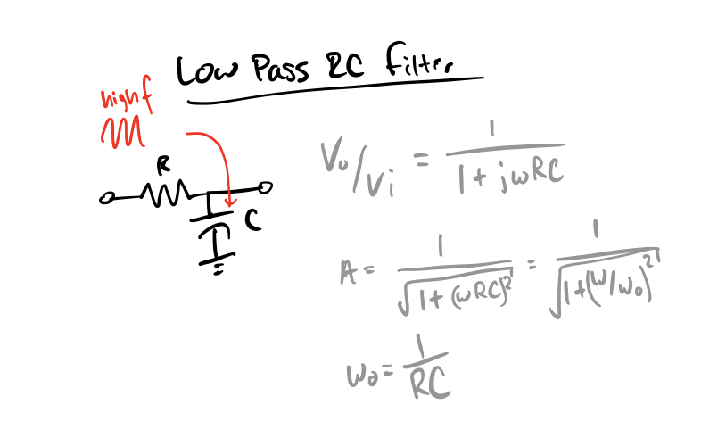
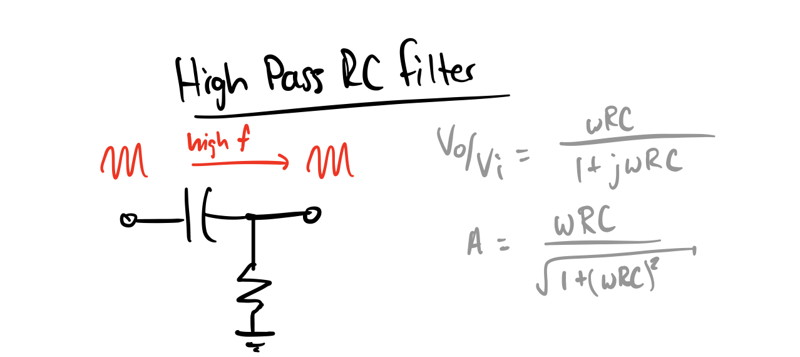

parent::[[Analog Filters]]
#inbox/later  add in [[02-Lab-RC-Circuits✅]] findings

> The below describes the first order RC filter, for the second order RC filter see [[Higher Order RC Filters (Passive)]]

Also see [[The effect of loading filter circuits]]

**Corner Frequency**:
- $w_0 = \frac{1}{RC}$ or $f_0 = \frac{1}{2\pi R C}$

**Impedance**:
- $Z_{in}  = R+Z_C = R - \frac{j}{\omega C}$
- $|{Z_{in}}|  = \sqrt{R^2 + Z_C^2}$ (ignoring phase angle) = $\sqrt{R^2 + \frac{1}{(\omega C)^2} }$
	- $\lim\omega C \to \infty = R$
	- $\lim\omega C \to 0 = \infty$
- $Z_{out} = R || Z_C = \frac{R \frac{-j}{\omega C} }{R - \frac{j}{\omega C} } = \frac{-jR}{\omega RC - j}$
	- $\lim\omega C \to \infty = 0$
	- $\lim\omega C \to 0 = R$

**Time constant:** you can measure the time constant in two ways; 1) the time of the decay or 2) measuring the frequency at which the output amplitude drops by a specific amount
    - step response: $V_C = V_0 e^{-t/RC}$
        - 1/2 time at $t_{1/2}=ln(2) \cdot RC \Rightarrow RC=\frac{t_{1/2}}{ln(2)}$
    - sine wave response: $V_{out}/V_{in}=\frac{1}{\sqrt{1+(2\pi f RC)^2}}$ (high pass)

## Low Pass
- capacitor shorts high freq. signals to ground, passes low frequencies
- can be used as an Integrator (→ see [[02-RC-Circuits✅#Integrator]] )

## High Pass
[[High Pass Filter]]
- capacitor passes high frequencies, blocks DC
- can be used as a basic Differentiator (→ [[02-RC-Circuits✅#Differentiator]])

#todo is this wrong, do I need j in numerator?
## See Also
- [[RLC Filters]]

parent::[[Analog Filters]]

