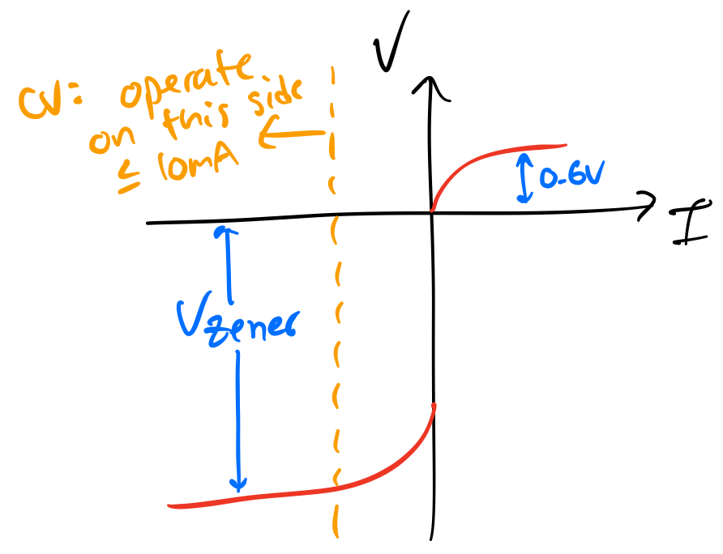

parent::[[215-LAoE]]
prev:: [[02-RC-Circuits✅]]
next:: [[04-Transistors-1]]
garden-topic::: [[Diodes]], [[RLC Filters]]
status:: #status/🟡 #anki-todo 
#todo/img diode i v curve 

# Summary
Summary::Inductors block high frequencies and pass low; When combined in parallel with a capacitor a bandpass filter is created; Resonant frequency is where the impedances of R and L are equal and opposite, thus cancelling completely; Q factor measures how narrow the frequency response is around the resonant frequency or how slow energy leaks from the R/L elements; design tradeoff between high Q (high R) and lower energy, or higher energy (lower R) and lower Q; Effect of ripple on transformer sizing requirements; High frequencies used as carriers due to easier transmitting and receiving antenna designs; simple radio filter 

1) **Inductors**
- Inductors block high frequencies and pass low frequencies.
- In practice, capacitors are preferred over inductors in filters due to power dissipation and size.
 2) **Parallel RLC Bandpass Circuit**
- RLC circuits have a resonant frequency, not a cutoff frequency.
- Resonant frequency occurs when $|Z_C|=|Z_L|$ at $\omega_0=\frac{1}{\sqrt{LC}}$ or $f_0=\frac{1}{2\pi \sqrt{LC}}$.
- Design choices involve a tradeoff between Q factor and energy.
 3) **Basic Diode Circuits**
- Diode I-V Curve is nonlinear above the threshold voltage.
- Types include standard silicon and Schottky diodes.
- Zener diodes are used for low reverse voltage; installed "reverse" as a voltage-controlled switch.
 4) **Half Wave Rectifier**
- Uses a diode in series; clamps positive or negative voltages upon a sinusoidal input.
- Clamps circuits can use a zener diode for voltage regulation.
 5) **Full Wave Bridge Rectifier**
- Two diodes active during each half cycle.
- Ripple effect on transformer sizing due to charging and discharging of the output capacitor.
 6) **RLC Circuits Applied to Radios (Amplitude Modulation)**
- Radio stages include rectifying the carrier signal and removing the carrier envelope with an LC filter.
- Example circuit: "leaky peak detector" for separating high-frequency carrier signals from lower audio frequency.

# Inductors

Inductors function to **block high frequencies** and **pass low frequencies**. In principle the magnetic field resists time-varying current. 

Why we use capacitors in low and highpass filters instead of inductors? #anki-todo  Because inductors dissipate more power and are large

We _could_ use an inductor in something like an RL lowpass or RL highpass, but in practice inductors **dissipate more power and are large**.

Inductors are used in RLC bandpass filter circuits.

# The Parallel RLC Bandpass Circuit → [[Parallel RLC Bandpass (Acceptor)]]
Summary: [[RLC Filters]]

RLC circuits don't have a cutoff frequency but rather a **resonant frequency**, $f_0$. At the resonant frequency the combined RL parallel impedance is at a maximum, so the filter will pass the most signal. 

> Note the series RLC circuit is the opposite- at resonance impedance is maximum [[Series RLC Bandstop Circuit (Rejector)]]

Resonant frequency occurs when $|Z_C|=|Z_L|$ which happens at $\omega_0=\frac{1}{\sqrt{LC}}$ or $f_0=\frac{1}{2\pi \sqrt{LC}}$.

 → see [[Q factor]]
 
_Design Choices_ are a tradeoff between Q and energy out.
- **high R**: higher Q but less energy out (attenuates more energy)
- **low R**: lower Q but more energy out (attenuates less)

> Aside: the parallel RLC circuit allows you to test the Fourier Series of a square wave. [[Fourier Series decompose any signal into sinusoids]]

# Basic Diode Circuits - [[Advanced Rectifier Circuits]]

**Theory of operation:**:
The diode _I-V Curve_ has a non-linear response above the threshold voltage (usually. ~0.6V), blocks reverse voltage until reverse breakdown at ~100V. Reverse current before breakdown is in the nanoamp range.

Examples: See [[Zener Diode Circuits]] and [[Diodes]]

**Types**
- _standard silicone_: (e.g. `1N914`) turn on voltage of 0.6V; forward voltage drop of 1.4V
- _Schottky_: (e.g. `1N5711`) low forward voltage drop, around 0.4V

- [[Zener Diodes]]: likes to conduct at _low reverse voltage_; breakdown voltage is sooner and not destructive (must operate with at least 10mA to make sure we are in the $V_{zener}$ horizontal slope range) - typ. installed "reverse" as a voltage controlled switch
**Half Wave Rectifier**
A diode in series with the source can be used as a half wave rectifier (forward or reversed bias, as long as we don't exceed breakdown) 

#todo/lab-test
== if we reverse bias the diode we will clip all the positive
 

**Clamps**
clamp circuits #anki-todo 
- can clamp positive or negative voltages (or both) upon a sinusoidal input
- we can also use a zener diode for this (see [[Zener Diode Circuits]])

We can also use a reverse biased zener diode to clamp the output^[For a zener to regulate voltage we wil practically need a transistor or op-amp afterwards to limit variation in output current]. When reversed biased in the breakdown region, the zener will provide a low impedance path to ground, keeping its cathode at a nearly constant voltage (if reverse current is >10mA). 

# Full Wave Bridge Rectifier

Theory of operation - single rail: Two diodes are active during each half cycle, when the ac input current crosses zero, the active diodes cutoff and the two other diodes become active. In practice a power capacitor and bleeder resistor are added on the output. 

For dual supply output we need to centertap the supply transformer and output capacitors.

Drawbacks of a **Full Bridge** for use in a radio rectifier: #anki-todo 
- input and output cannot share the same ground reference (current needs to flow through the load on both half cycles)
- 2 diode drops (vs. 1 of a half bridge)

## Ripple on a Full Bridge Rectifier 
→ See [[Example - Full Bridge Rectifier]]

An important implication of ripple to power supply design is that the **spikes in current from the ripple call for a higher rated transformer** than under steady load current. The transformer has to "work harder" to replenish the capacitor during the charging portion of the cycle. If the charging portion is 3/8 of the 8ms cycle and the load current is $I_{LD}$ then **the capacitor will charge at $\frac{8}{3}\cdot I_{LD}$ to replace the current lost in the discharge portion of the cycle** (since $I_{LD}$ needs to average to itself over the cycle). 

The calculation for this current's RMS value (which gives the amount of heating and thus size of the transformer) is:
$$ I_{rms}=\sqrt{(\text{charging fraction})\times(\text{current})^2}$$
so for a 3/8 charging fraction
$$I_{rms}=\sqrt{(3/8)\times(8I_{LD}/3)^2}\approx 1.6 I_{LD}$$

A **small ripple is clearly worse** in the sense that we will need to oversize our transformer the smaller the ripple (we can use solid state voltage regulators to smooth out these power supply ripples to much smaller values without requiring huge transformers).

## RLC Circuits Applied to Radios (Amplitude Modulation) → [[Analog Filters]]

Radio combines (modulates) the audio signal with high frequency carrier signals that are more efficiently transmitted. Since attenna design calls for an antenna size of half-wavelengths, $\lambda/2$, a 1MHz signal requires a 500 foot antenna but a 1kHz signal requires a 500km antenna, _Ouch!_. 

The stages of a radio 1) rectify the carrier signal with a half bridge and 2) remove the carrier envelope (demodulate) with an LC filter.

The following circuit example is a "leaky peak detector" that can separate the high frequency carrier signals (~1MHz) from the lower audio frequency:

---
Next Up: [[04-Transistors-1]]
