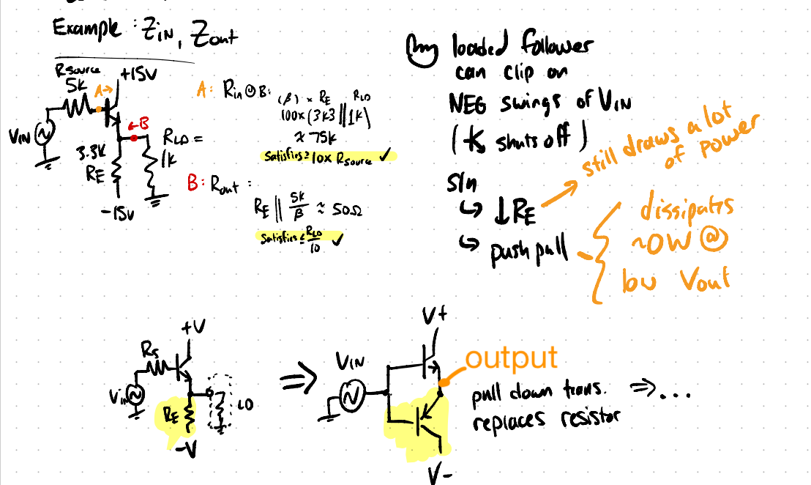

parent:: [[215-LAoE]]
prev:: [[03-Diode-Circuits]]
next:: [[05-Transistors-2]]
garden-topic:: [[BJTs]]

==TODO== link to pdf raw notes (goodnotes)

Summary::Transistor is a current controlled amplifier as well as an impedance changer; the base presents a high impedance; so we can attach lower impedance loads and not violate our 10% rule; 4 simple BJT circuits -  follower, current source, amplifier and switch; Although we think of it as a current amplifier, in reality Ic is due to Vbe as explained by the Ebers Moll view; Common Emitter Amplifier; In Reality MOSFETs are used more often as switches; Examples: 

# Ch. 4 Transistors 1 
Transistors are a three terminal device with two types of doped silicon (n or p). The "base" terminal is the control terminal - the amount of base current controls the amount of Collector-Emitter flow. 

Terminology: The "collector" is the terminal that the electrons _collect_. Thus conventional current for an _npn_ transistor is from the collector to emitter

## Ways to View a Transistor

**Simple**: $I_C=\beta I_B$ ^[The notation for the gain, $\beta$ and $h_{fe}$ are interchangeable.]
**Simpler**: $I_C \approx I_E$; $V_{BE}=0.6V$
 - both assume of course that the transistor is _on_ (base is 0.6V more than the emitter and collector is positively biased)
 - can usually assume $\beta \approx 100$ (conservatively; this is an underestimation)

**Key points** when _on_ (for npn):
- $V_{BE} = 0.6V$ (constant "diode" voltage drop from base to emitter) 

### Impedance of a Transistor Depends on Your Point of View
The impedance that a transistor presents a circuit depends on if we are looking "into" the base (from the left side) or "back into the emitter" (from the right side). 

**Looking into the base** (_on_): The _base_ presents a **high impedance** and anything connected to the other side, the _emitter_ needs to be multiplied by ~100 (i.e. the value of $\beta$) to get the equivalent impedance on the base side.

**Looking at the emitter back to the base**: The _emitter_ "sees" a low impedance when looking back at the base, of $R_B/\beta$. 

**Looking at the collector**: The _collector_  is **high impedance** - sometimes regarded as infinite (this is how we can use it as a current source). ~~This is because $V_{CE}$ will not change much while $I_C$ can be large or small determined by $I_B$, thus $Z_C=\frac{\Delta V_{CE}}{\Delta I_C}$ will be large~~.  High impedance means that the load impedance won't affect the sourced current, since the $Z_{collec tor}>>Z_{load}$, making the collector a good [[Current Source]] (==TODO== check this explanation) The true impedance can be determined from the [[Early Effect]] (see Chapter 5 Supplemental Notes)

#### Determining Transistor Type with a Diode Test

An npn will conduct (under a diode test) from the base to the collector and emitter. The pnp will conduct in the opposite direction, from collector/emitter to base. 

## Simple Transistor Circuits
See further [[BJTs]] 

#anki-todo 

### Current Amplifier
The simplest view of a transistor is as a current amplifier ($I_C= \beta I_B$). Since $\beta$ is usually in the hundreds 
$$I_E=I_C+I_B=(1+\beta)\cdot I_B$$
$$ \therefore I_E \approx I_B $$

> In reality $I_C$ is determined by $V_{BE}$ rather than $I_B$, explained more in [[05-Transistors-2]]  in the Ebers-Moll view and in [[BJTs]].

### Current Source
→ [[BJT current source]]
Circuit description: 
- a current is input into the base, which "controls" the collector-emitter current by the gain factor
- output is taken at the collector terminal since it is high impedance, which is what we want for a current source
	- e.g. a lamp from the source voltage on its (+) side and its (-) side connected to the collector
- usually a resistor is placed on the emitter to limit current

**Limitations**:
- as the load increases the collector voltage $V_C$ decreases to the point where $V_{CE}$ is low enough to make the circuit ohmic (forces $V_{CE} \approx 0$ and the transistor is in "saturation")

### Voltage Follower
tl;dr the emitter follower develops into the push pull

The [[Emitter Follower]] takes the output at the _emitter_, V+ at the _collector_ and the **input** as a voltage excursion into the _base_, the **emitter voltage will follow the base voltage** ($V_E=V_B-0.6$). 

We can think of it as the small $\Delta I_B$ driving a large $\Delta I_E$ over a resistor connected to the emitter -- if we measure $V_E$ we will see this voltage excursion.

**Limitations**: If we don't bias $V_B$ enough, we will clip when $V_{BE}<0.6$.

For a single supply, we can add a voltage divider into the base with a blocking capacitor on the 0V-centered input, so the voltage excursion can pass through and be output at a higher DC voltage (determined by the base voltage).

> Note that adding this biasing circuit  reduces the input impedance by a factor of 10, see AoE sec 2.4.3 for a bootstrap circuit solution

Also, usually we put an input resistor (small < 300 Ohms) to prevent oscillations. 

#### Asymmetry Causes Clipping - Development of Push Pull

**Limitation**: asymmetry can produce clipping on negative input swings. 

> LAoE Figure 4N.24. The circuit above, we seem to meet our input and output impedance requirements

This circuits output clips on the negative swing when the input amplitude is above 4V (-4V into the base).

This is because the 3K3 Re keeps the emitter "away enough" from the -15V supply that the transistor shuts off. And we don't want to decrease this resistor because we add unnecessary power draw.

The solution is to add a pnp/p-channel transistor to replace the resistor. The pnp is activated when there is a negative base current and the base is negative wrt to the emitter.  → [[Example - Development of Push Pull from Emitter Follower]]

### Common Emitter Voltage Amplifier 
The [[Common Emitter Amplifier]] is similar to the _current source_ circuit, except here we are taking $V_{out}$ at $V_C$ after an $R_C$. Taking a small $\Delta V_{in}$  at the *base* we get a larger $V_{out}$ at the _collector_. 

This circuit has the same clipping drawbacks as some of the others, clipping on negative swings of $V_{in}$, which the **push pull** circuit tries to solve. [[push pull emitter follower]]

### Switch
Mostly MOSFETS will be used for switching applications, but a bipolar transistor can function as one. Switching the base current on and off allows us to drive a large load with a small input current ($I_B << I_C$).

Switches:
- operate in saturation mode 
- need to overdrive the base by around x10
- load current is determined by _load_ instead of $\beta \times I_B$
- $R_{IN}$ is much lower than the linear-region transistor case where $R_{IN}$ looks much bigger due to the $\beta$ factor

# Worked Examples

## 1) [[Example - AC Coupled Emitter Follower Impedance Changer]]

## 2) [[Example - Phase Splitter]]

## 3) [[BJT Follower vs Switch Power Dissipation]]

# See Also 
- AoE §2.1 to 2.2.8 and §2.4.1
next:: [[05-Transistors-2]]