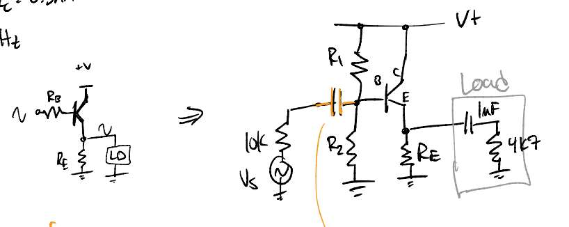

parent:: [[Emitter Follower]], [[04-Transistors-1✅]]

**Problem Motivation**: We want to drive a 4.7KOhm load with a 10KOhm source -- this violates our rule to keep the source/input impedance less than one tenth of the load/output impedance. The transistor emitter follower circuit gives us an "impedance changer" - the output of the emitter "sees" the base impedance as divided by the gain factor of 100, so we can meet our driver < load/10 impedance requirements.

**Problem**: Design an ac-coupled emitter follower with attenuation < 10%, quiescent current 0.5mA, and a high pass cutoff frequency at 100 Hz. Notes
- Single supply of +15V
- 10K source resistance
- Load is RC circuit 1uF and 4.7KOhms

Image::

#q actually step 1) is assuming a Ve, choose Re s.t. Iq is 0.5mA

**Solution Steps**:
1. Draw the emitter follower circuit. *Single supply* -> *voltage divider* to bias the base. *Ac coupling* -> *Blocking Cap* after input. *Emitter-Follower* takes the output (voltage) at the _emitter_ with an _emitter resistor_ to ground.
2. **$R_E$ and $V_E$ Determine $I_Q$**: Start with the $I_C$ or $I_Q$ - the _quiescent_, or "low input" current. Here it is the **dc** current.
	- design for the quiescent voltage at the midpoint of the supply (so 15/2 = 7.5V)
	- this voltage will determine the resistance since we need to design for $I_C=0.5mA$
		- **$R_E$** $=V_Q/I_Q=7.5V/0.5mA$ **$=15k\Omega$**
3. **$R_1, R_2$ Determine $V_B$ (but must be 1/10 of $\beta R_E$)**: The tricky part is determining the voltage divider which has to 1) drop the correct voltage to keep the transistor on 2) not affect the output (1/10 output impedance) and 3) pass the input (x10 source impedance)
	- simply set $V_B=V_{CC}/2$, again at 7.5V;  $\therefore R_1=R_2$
	- calculate the _Thevenin_ Resistance s.t. $R_{TH} < R_{out}/10$
		- we can ignore the 4K7 load resistor due to the _blocking capacitor_ (we are still looking at **dc** here)
		- $R_E$ looks like $R_E \times \beta=100 \cdot 15k=1.5M$ looking into the base 
		- Then the requirement is that $R_{TH} < 1.5M/10 = 150k$
			- $R_{TH} = R_1 || R_2$ so **$R_1=R_2=300k\Omega$**
	- a final check would be to see that $R_{S} < 150K/10$ which it does.
 4. **Determine C s.t. $f_{3dB}=100Hz$**: Again we have to reflect impedances across the transistor base.
	 - now we are looking at _signal_ frequencies so we **cannot disregard $R_{LD}$** in the emitter resistance
		 - although we will ignore $C_{LD}$ in the example (assuming it doesn't attenuate much) 
	 - The equivalent resistance is the _voltage divider resistance_ in parallel with _100x the emitter resistance_. 
		 - _emitter resistance_: 15K || 4K7 = 3K6
			 - … seen from the _base_ (x100): 358K
		 - _V-div base resistance_: 300K || 300K = 150K (same as before)
		 - _total equivalent resistance_: 150K || 358K = 105K
	 - then choose C for 100Hz highpass:
		 - **$C$** $=\frac{1}{2\pi Rf}$ **$=0.015\mu F$**

## References
- [[hayesLearningTheArtOfElectronics2016]] Chapter 4 Worked Example 1