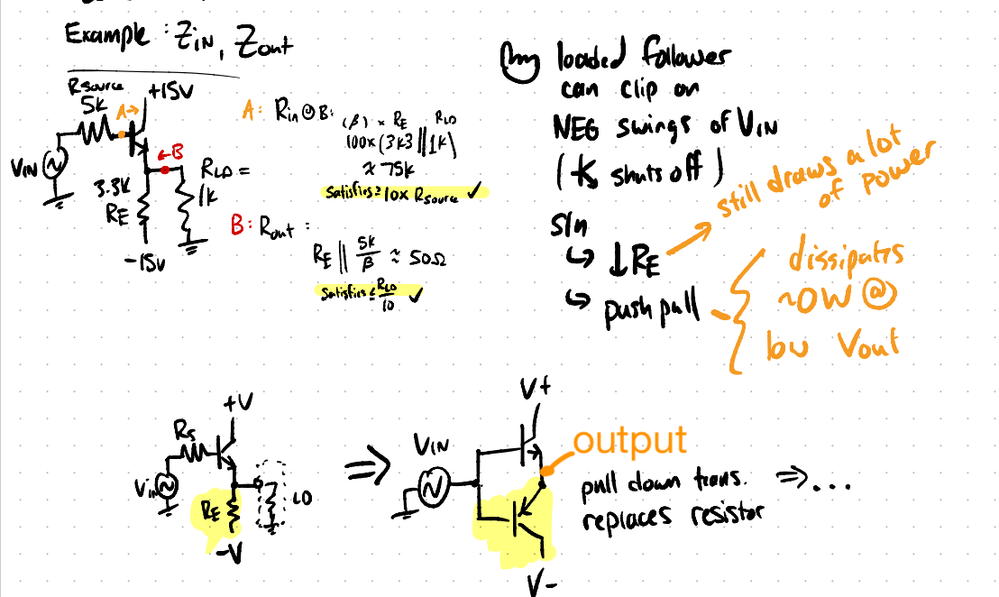
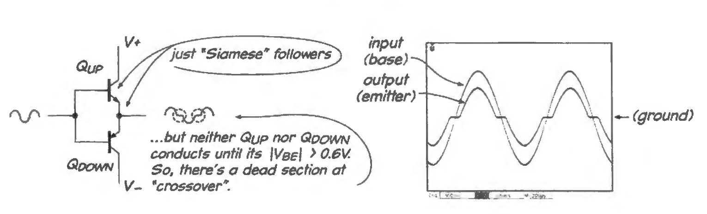
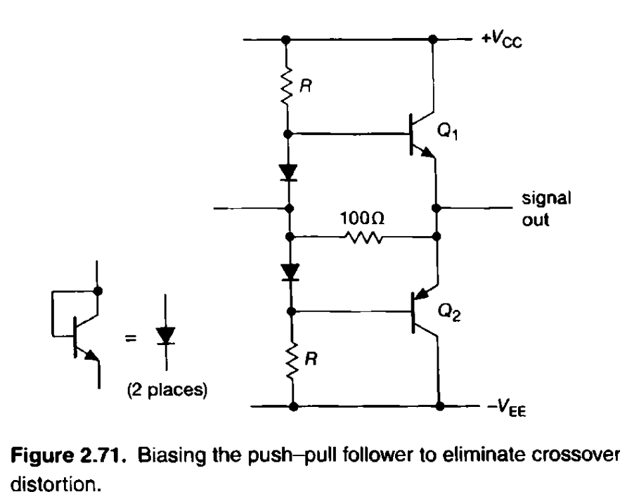

parent::[[04-Transistors-1]]

Summary:: For the emitter follower, negative inputs can clip the output due to the asymmetry of the circuit (driving with transistor, pulling with resistor). We can add a pull down (p-type) transistor to replace the resistor which turns ON for the negative swings ;→ this is the [[push pull emitter follower]]

See [[04-Transistors-1#Voltage Follower]]

A true push pull will fix the crossover distortion by biasing the bases of the transistors apart so that there isn't a section of time that both V_BEs are < 0.6V.

