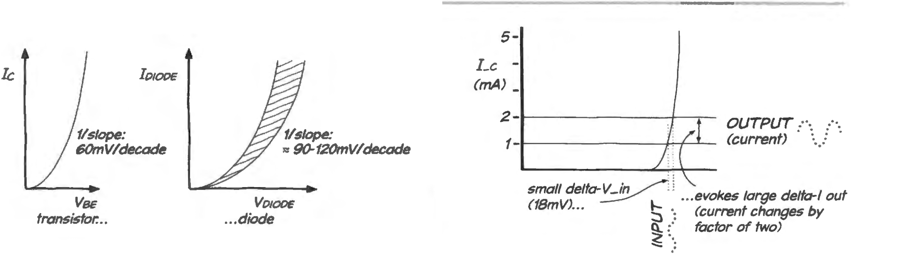
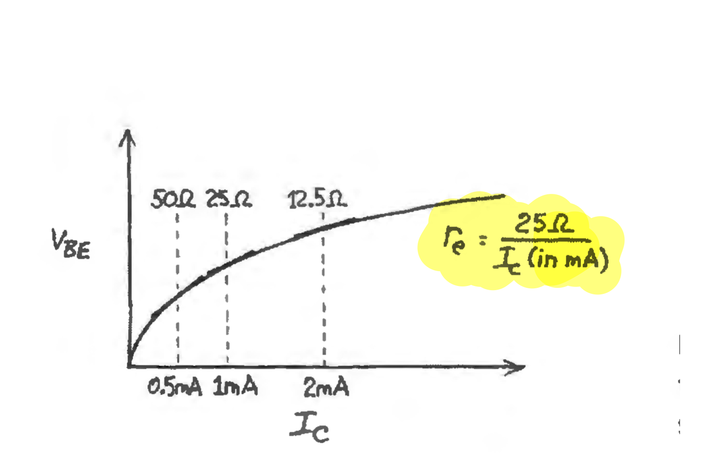
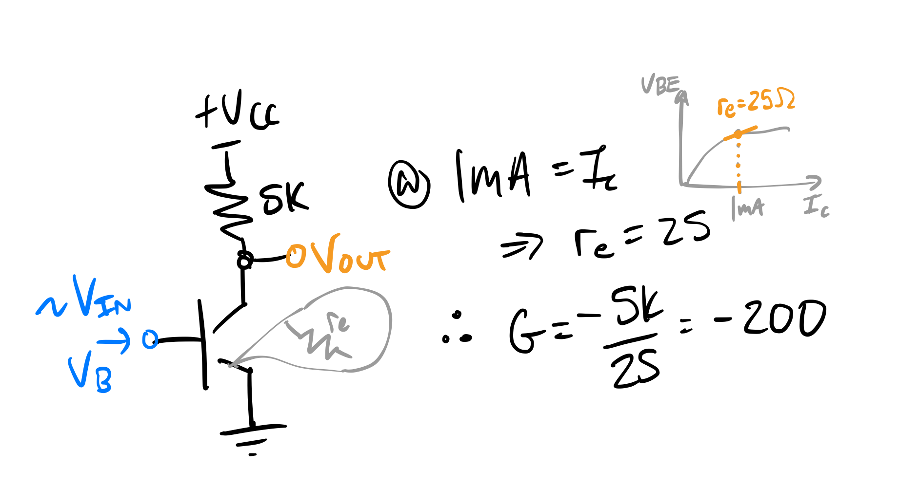
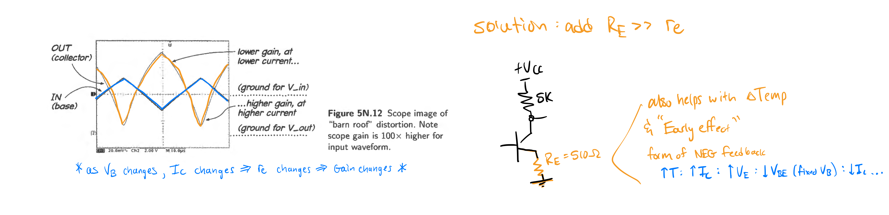
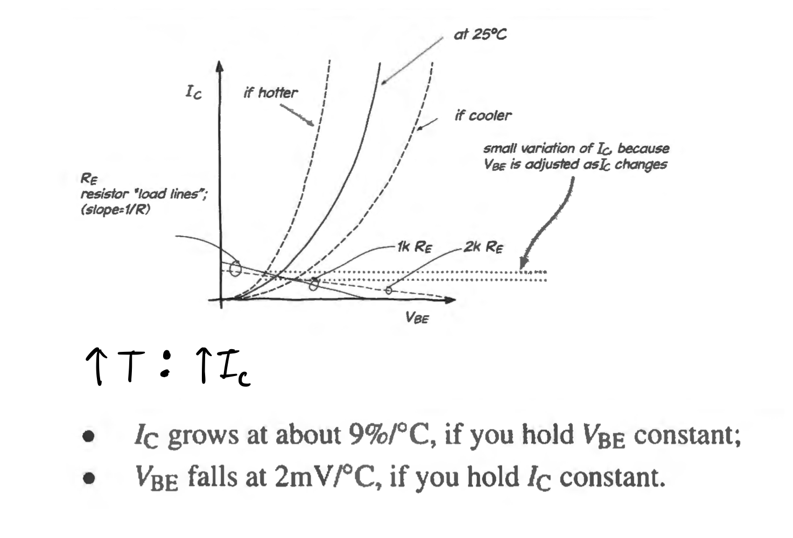
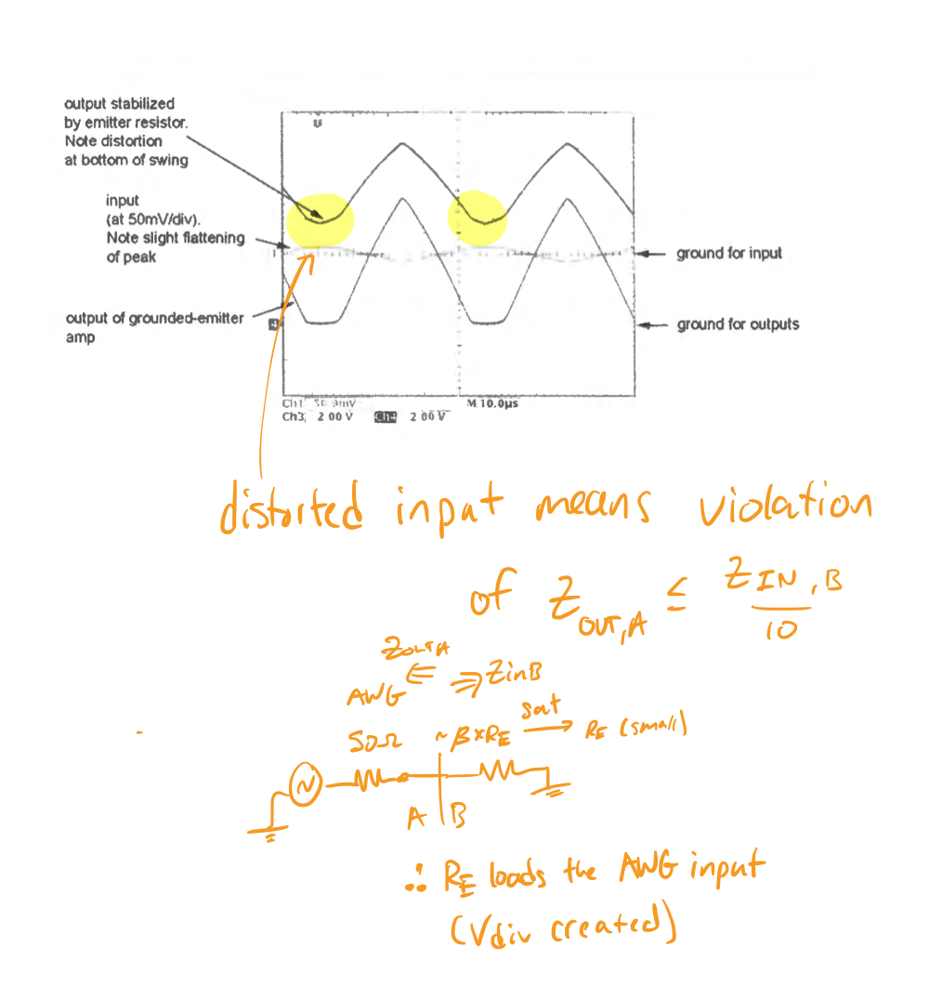
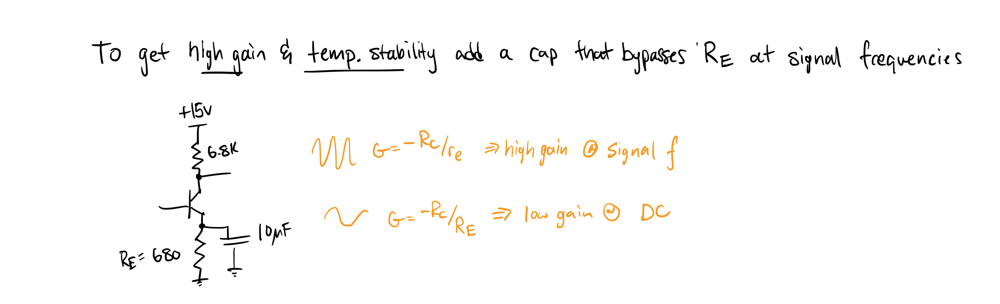
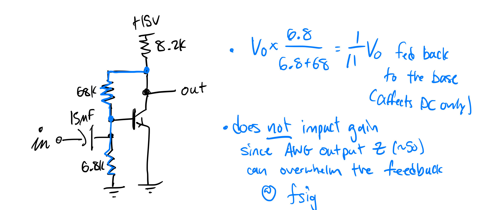
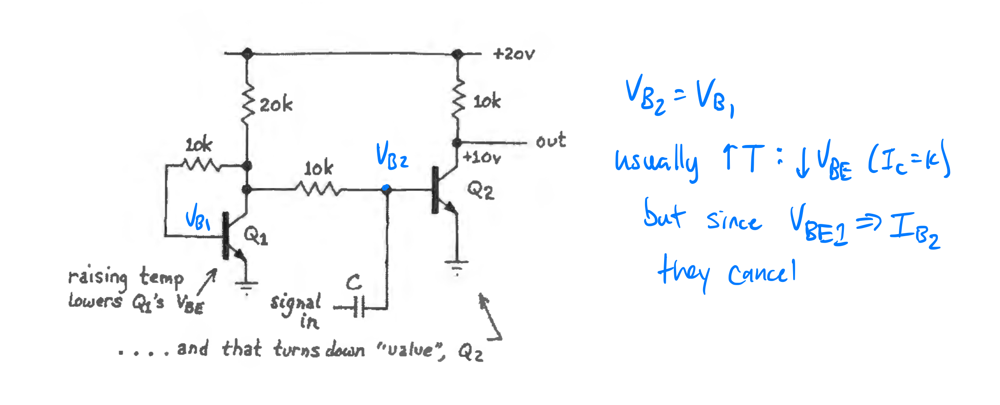
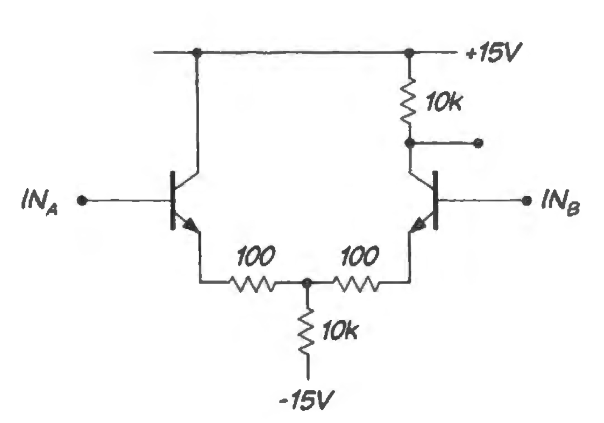

parent:: [[215-LAoE]]
prev:: [[04-Transistors-1]]
next:: [[06-Op-Amps-1]]

garden-topic::[[BJTs]]
Summary::
# Ebers-Moll, Gain & Temperature Stability

## We Need to Include [[Intrinsic Emitter Resistance]] in Output Impedance Calculations of Common Emitter Amplifier Circuits

Previously we erroneously calculated the output impedance of a [[Phase Splitter]] when we didn't take the _intrinsic emitter resistance_, $r_e$, into account. This resistance is low when the transistor is on, so the output impedance for the emitter follower circuit is a parallel combination of $R_E$ and $r_e$ in parallel with the base impedance scaled down by $\beta$. Since the small impedances dominate in the parallel configuration we cannot ignore the instrinsic resistance. 

## Ebers-Moll Shows That $I_C$ Varies Exponentially with $V_{BE}$

This leads to the [[Ebers-Moll view of transistors]] which says that $I_C$, far from being equal to $I_E$, is actually determined by $V_{BE}$ (and vice versa) - much like the diode drop voltage depends on the current through the p-n junction. 

Simplified, Ebers-Moll gives $I_C$ as an exponential function of $V_{BE}$:
$$ I_C \approx I_S\times e^{\frac{V_{BE}}{25mV}}$$

| $\Delta V_{BE}$ | $\Delta I_C$ | 
| --- | --- | 
| 18mV | x2 |
| 60mV | x10| 

With the **base voltage fixed** Ebers-Moll tells us "how much more collector current we will get if we pull down the emitter voltage". The relationship is exponential, but if we swap axes we can get the _intrinsic emitter resistance_, $r_e$. 

This helps in analyzing the **common emitter amplifier** mode, where a small $\Delta V_{IN}$ yields a large change in output current (and thus voltage). Using the table above, an 18mV change in input voltage results in **twice** the current output. 

## $r_e$ Determines Gain for the Grounded Common Emitter Amplifier Transistor

If we include the _[[intrinsic emitter resistance]]_ in the most simple grounded common emitter amplifier circuit, we can calculate the gain as $G=R_C/r_e$. 

## But High Gain Comes With a Price

If the _[[intrinsic emitter resistance]]_ is **not negligible** it can cause distortion in the grounded emitter circuit -- this is the price we pay for high gain.  ^msy37p

This works as following:
- $V_B$ changes, causing $I_C$ to change which affects $r_e$, which changes the **gain**
- this means lower gain at lower current, higher gain at higher current 
	- for a triangle wave input, the output looks like a "barn roof"
- **solution**: add an emitter resistor, $R_E$ that swamps the effect of $r_e$ in the gain equation
- **effect**: we decrease the distortion as well as the gain variation.

## Collector Current Increases with Temperature, Base-Emitter Voltage Decreases

The $I_C$ vs $V_{BE}$ curve shifts with temperature - even small changes in temperature can have a large affect. An increase in temperature causes the graph to shift to the left (for a constant $V_{BE}$, $I_C$ *increases* with increasing temperature; for a constant $I_C$, $V_{BE})$ _decreases_ with temperature.

For the **common emitter amplifier** circuit, the affect is that  $V_{OUT}$ is distorted on one side of the input swing. Since we can see that the input is also distored we know we have violated our "[[Output impedance of the supply circuit should be less than 10 pct of the load circuit input impedance]]" rule. 

The temperature change can throw the transistor into saturation. When this happens the $h_{fe}$ decreases dramatically thus the effective $R_{in}$ at the base decreases and can end up competing with even the 50 Ohm $R_{out}$ of a signal generator -- the result is distortion on the input which caries over to the output. ^i7q5d2

 ^z13213

A few solutions:
- **Emitter resistor**: the increased $I_C$ causes a larger voltage drop across $R_E$, bringing $V_E$ further away from ground and decreasing $V_{BE}$. 
- **DC feedback**:  dc feedback will increase the base voltage keeping the transistor on where it previously it clipped.
- **Dual transistors**: the collector output of one transistor feeds the base of another; rising temperature increases the collector current on one transistor which is counteracted by the decrease in $V_{BE}$ on the other.

### Emitter Resistor
An emitter resistor will bring $V_E$ further from ground with increases in $I_C$ (this is just Ohm's Law). If $V_B$ is fixed then the decrease in $V_{BE}$ counteracts the increase in $I_C$.

For high gain and temperature stability we can **add a capacitor that bypasses $R_E$ at signal frequencies**.

### DC Feedback
With a voltage divider from the output to the base (input), we can feed ~1/10th of the output back. This increases the base voltage at increased output. Due to the blocking capacitor this doesn't affect circuit gain, only DC levels (in contrary to op amps).

### Dual Transistors
Also see [[Current Mirror]].

Increasing temperature lowers $Q_1$'s $V_{BE}$ which causes less current to flow into the base of $Q_2$. (thus canceling the increased temperature => increased $I_C$ of $Q_2$).

# A Basic Differential Amplifier

Two transistors in common emitter configuration can be used as the building blocks for a differential amplifier which:
- removes noise common to both input (how much is determined by the "common mode rejection ratio")
- can be used with a high impedance source output

The circuit works as a difference amplifier by decreasing gain for signals common to each input, and increasing gain for differences. It is the building block for [[Op Amps]].

A full analysis can be found in [[Example - Differential Amplifier From Common-Emitter Transistor]] - first we look at the quiescent-pure-common case, then the signal-pure-difference case, and finally the signal-pure-common case. 

# Other
Not covered but related:
- [[Current Mirror]] and the Earlly Effect (the output impedance of current sources)
- transistor emitter resistance as viewed from the collector
- [[Miller Effect]]: is an obstacle to high frequency (>1MHz) amplifier design; capacitive feedback in any inverting amplifier opposes changes at the input 

# Summary

Ebers-Moll View of Transistors
- $I_C$ is determiend by $V_{BE}$
- $R_{IN}=(1+\beta)\times R_E$
- $R_{OUT}=[r_e + R_{SOURCE}/\beta]$ || $R_E$
	- and usually $R_E$ ignored since much larger
- $R_{OUT}$ at the **collector** is just $R_C$ since collector intrinsic impedance is huge
	- Generally the transistor holds $I_C$ constant regardless of $V_C$ value -- the Early-effect explains this small departure from the general truth

Switches
- operate in saturation mode (thus not an impedance changer)
- need to overdrive the base by around x10
- load current is determined by _load_ instead of $\beta \times I_B$
- $R_{IN}$ is much lower than the linear-region transistor case where $R_{IN}$ looks much bigger due to the $\beta$ factor

# Navigation
Next Up: [[06-Op-Amps-1]]
