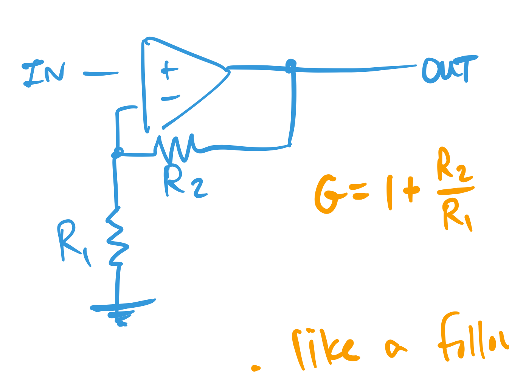

parent:: [[215-LAoE]]
garden-topic:: [[Op Amps]]
next::[[07-Op-Amps-2]]
status:: #status/✅ 
pdf:: [[hayesLearningTheArtOfElectronics_CH06-Op-Amps-1 1.pdf]]
also see: [[06-Lab-Op-Amps-1]], [[06-Examples-Op-Amps-1]]

summary:: The basic theory of using negative feedback with Op Amps. We see how the golden rules force the input terminals to near equality, which results in an output transfer function that is the inverse of whatever is between the output and the inverting input. We look at making an ideal integrator and summing circuits by employing a "virtual ground" in the inverting amplifier circuit. Then we see how we can produce inverse transfer functions by placing components in the feedback path. 

# Also See
- [[horowitzArtOfElectronics2015]] section 2.5 - negative feedback & 4.1-4.2

# Garden Notes
- [[feedback can hide things we don't want to see]]
- [[the op-amp with feedback cleverly generates the output needed to make the inputs equal]]

 The Importance of Negative Feedback Invented by Harold Black, negative feedback is what make Op Amps tick. In reality Op Amps are just very high gain amplifiers, it is when they are used in configuration with negative feedback when they can do magic. 

negative feedback is also employed in [[33.10L Motor Control]] and [[33.11L Voltage Regulators]] and [[33.13L FM radio]].

We've already employed feedback in 
- the [[Common Emitter Amplifier]] circuit where we added the emitter resistor to squeeze down the base-emitter voltage with increased collector current (from e.g. [[temperate effects]])  (⬆️ Ic: ⬆️ Ve: ⬇️ Vbe … ⬇️ Ic)
- another C-E amplifier where we used a voltage divider from the supply into the base to hold it there (and provide an offset)

The Op Amp Golden Rules apply when using negative feedback:
> [!tip] the difference between the non-inverting and inverting terminals is 0V

> [!tip] the input draws no current

 Op Amp Parameters
 Supply Power
- the op-amp can only source or sink ~25mA, use a transistor in the follower loop to provide more current (cf [[06-Op-Amps-1#Current Source Transistor in feedback path of follower]])

#  Op Amp Circuits

The Op Amp does not drive the inputs to equality - only near equality so the high gain can do its magic (remember the op amp is a differential amplifier). 

How close? To $V^+-V^-=V_{out}/G_{OL}$. For the 200,000 open loop gain of the 411, at 11V this is $50\mu V$

## Follower (or Non-inverting buffer)

Pros:
- high (infinite) input impedance 
- low (~100 Ohms) output impedance 
- no voltage drop (vs. the diode drop on a BJT)

We can use a follower and place anything inside the feedback loop to make it "ideal"

## Non-Inverting Amplifier
- like a follower but with gain
	- input to the non-inverting terminal
	- feedback from the output to the inverting terminal (this makes it negative feedback)
	- we feed back Vo(R1/R1+R2), which becomes 1 +R2/R1 when we solve the equation for gain (gain is the inverse of the fraction fed back)
	- so the larger R2 is, the lower the feedback voltage over R1 is, and the greater the gain is
- **don't forget the 1+** in the gain equation (vs the more simple gain equation of the inverting amplifier)
- $G=1+\frac{R_1}{R_2}$

#anki-todo 

> [!tip] Gain is the inverse of the fraction fed back
- so if 1V out of 11V is fed back, the gain is $(1/11)^{-1}=11$
- another way: the op amp works to keep the input terminals equal; by driving a current over the feedback resistors, the only way for the op amp to keep the input terminal equal is to drive the output higher → [[Intuitive Op Amp Understanding]]
 ^fgsl0k

## Inverting Amplifier
- input is now to the inverting terminal
- non-inverting terminal **tied to ground** ➡️ now the inverting terminal is at "virtual ground" (aka summing junction)
	- the input impedance is just the input resistor (the feedback resistor is not "seen" by the source due to the virtual ground)
	- the current will be determined by the input resistor ($R_1$)
	- multiple signals can be fed into this point and not intefere
- $G=\frac{-R_2}{R_1}$

> since the inverting input voltage is always greater than than the non inverting, the op amp drives a negative output voltage proportional to R2 
Note: we lose this ideal case for large R (typ. > 10M)

# Summing Circuits

# Integrator From Inverting Amplifier

The Op Amp can now be used to reach the ideal integrator we saw in [[02-RC-Circuits✅#Integrator]] - where we needed to squash the output (over the capacitor) to see the integration. We can keep the R-C junction point at ground using the virtual ground of the Inverting Amplifier

# Other Op-Amp Configs

# Current Source (Transistor in Feedback Path of follower)
→ [[Op-Amp Current Source]]
- op amp is used in follower mode with transistor in the feedback path
- this hides the 0.6V drop of the transistor B-E junction, and gives it more temperature stability
- gives better (higher) $Z_{IN}$ than the transistor alone
- gives better (lower) $Z_{OUT}$ 

# Push-Pull Follower - FIxing Crossover Distortion and Hiding the "dog"
[[Op Amp Fixes Crossover Distortion in Push Pull Follower]]

The op-amp voltage amplifiers show you the inverse of what is fed back ([[06-Op-Amps-1#^fgsl0k]])- but cases like the push-pull Follower and active rectifiers use feedback to hide things we don't want to see (crossover distortion or diode drops). ➡️ [[feedback can hide things we don't want to see]]

If we don't include the push-pull in the feedback path (feedback select = "silly" below), we will see the crossover distoration at the push-pull output. Including the push-pull in the loop gets rid of the distortion. In the second case if we measure at the **op-amp** output, we see "dog"$^{-1}$ ➡️ **[[the op-amp with feedback cleverly generates the output needed to make the inputs equal]] $V^- \approx V^+$** (here it is trying to achieve a clean sine wave) 

_Fig: Push-pull follower 1) in the loop (smart) 2) outside of the loop (silly)_

_Fig: Crossover distortion of a resistive load without op-amp feedback (left) and with (right). The output of the op-amp before the push-pull is shown to demonstrate how it cleverly generates the inverse waveform of the flats on the crossover push pull to make the output of the push-pull a clean sinusoid_

# Using a Follower and Feedback to Produce Inverse Transfer Functions

Just as above we see the inverse of the push-pull generated at the immediate output of the op-amp, we can put anything in the feedback path of the follower and measure the op-amp output to see the inverse of the feedback-path-circuit-function.

_Fig: (left) Putting a reverse-biased diode in the feedback path produces the log of the input. (right) Putting a squaring circuit in the path produces the square root_

