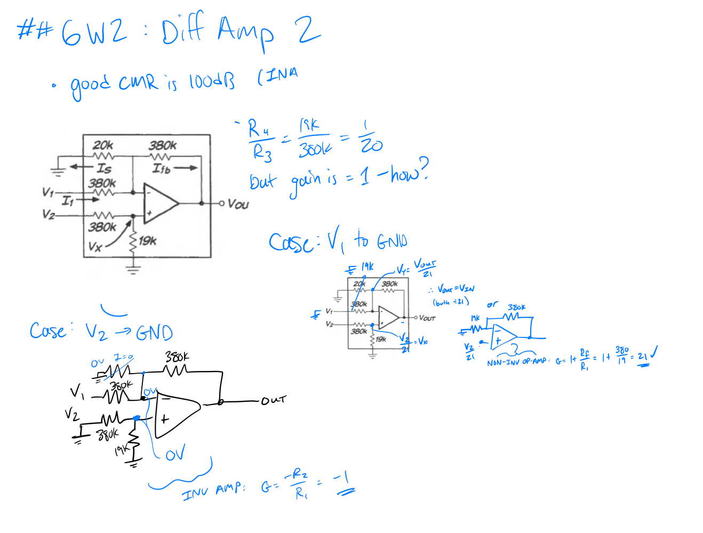
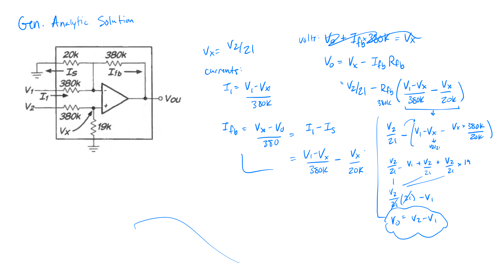

theory:: [[Op-Amp Differential Amplifier]]

Key Points:
- by looking at different cases we reduce the circuit to known op-amp configurations (inverter, non-inverter)

By Inspection
- With V2 to ground V+ and V- are at 0V and we can ignore the 20K resistor ➡️ this is just an [[Op-Amp Inverting Amplifier|Inverting Op-Amp]] with gain of $G=-380K/380K=-1$ ^gduegc
- With V1 to ground the parallel combination of 20K and 380K is 19K ➡️ this is just a [[Op-Amp Non-Inverting Amplifier|Non-inverting Op-Amp]] with $G=1+R_f/R_1=21$ times the voltage divider at $V_x$

