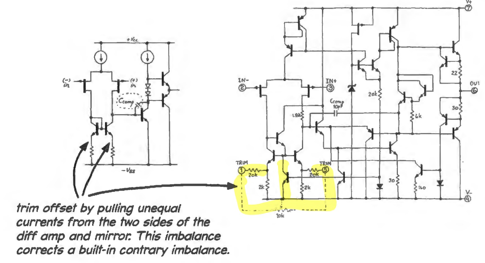

parent::[[215-LAoE]]

Offset Voltage
- the amp's delusion in thinking it sees a voltage difference between its terminals when it does not
- due to the imperfect matching in the two sides of its [[Differential Amplifier]] stage, as well as the current mirror that serves as the first stage's load
- can be compenstated by drawing more current out of one input stage than the other ➡️ "trimmig offset" (although temperature will throw things off again)

