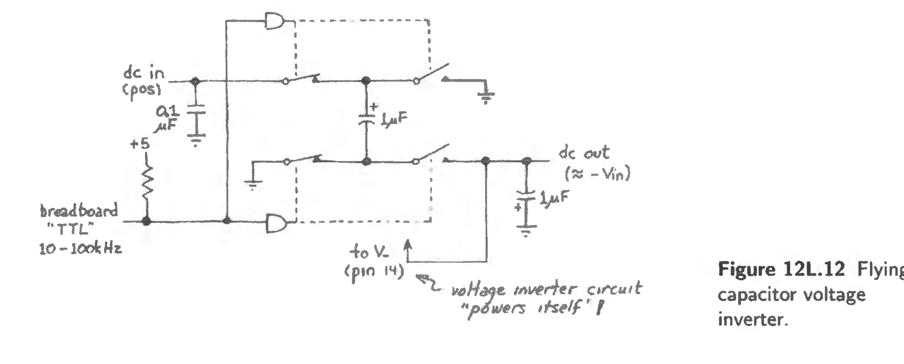

NB: took prelim notes in #a/liquid-text 
parent::[[215-LAoE]]

This lab focuses on MOSFET applications, as a power switch, as a logic switch, as an analog switch. Applicatios are [[Example - Power Switch BJT vs MOSFET]] (goes over temperature calcs),  [[Switched Capacitor Filter]], [[Example - Sample and Hold]] (which explores drawbacks of the CMOS)

Also touches on "Flying Capacitors" used to generate voltage above the supply input. 

## 12L.1 Power Mosfet 
- ➡️ [[MOSFET Power Switch]]

- [!] Careful of the specs - for $V_{GS(th)}$ and power dissipation

### Temperature Considerations

### 12L.1.4 Power Dissipation vs BJT

🔴 Subsume notes into [[MOSFET vs BJT]]

From $V_{DS}$ or $V_{CE}$ we can calculate the $R_{ON}$ for the FET/BJT. 

## 12L.2 Analog Switch Applications

🔴 ➡️ [[Analog Switch]]

### Sample and Hold 

🔴 ➡️ [[Example - Sample and Hold]]

### Flying Capacitor

Can generate a higher voltage than input.

Such circuits often are put onto an integrated circuit that would otherswise require either a negative  supply or a second positive supply, higher than the main supply. 

### Chopper

This circuit automatically switches given a clock input - allows for displaying two signals on one scope channel. 

