parent:: [[215-LAoE]]
garden-topic:: [[MOSFETs]]
lab::[[12L MOSFETs]]
status:: #status/🟠 
status-notes:: Digest semiconductor notes from supplemental, maybe into new page

## Key Points
- [[MOSFETs are less adversely affected by temperature changes]]
- [[Gate capacitance can cause kink in output voltage during switching]]
- The CMOS configuration (used for [[MOSFET Analog Signal Switch]] and [[MOSFET Logic Switches]]) is widely employed in modern day IC electronics (high gate capacitance can hold a charge, can swing rail to rail)

## Notes

A three terminal device like a [[BJTs|BJT]] but with some improved properties:
- very high gate (input) impedance - it is so high you can drive it with 5V through a human ➡️ thus low leakage current ()
	- the high stray capacitance at the gate can hold whatever charge is on it
- switching is better 
- semiconductor structure is near-symmetric - can switch in reverse if reverse biased
	- the more negative terminal is the effective source (of electrons)

## MOSFET Configurations

| Basic                            | With Body Diode Connected    | Semiconductor View |
| -------------------------------- | ---------------------------- | ------------------ |
| 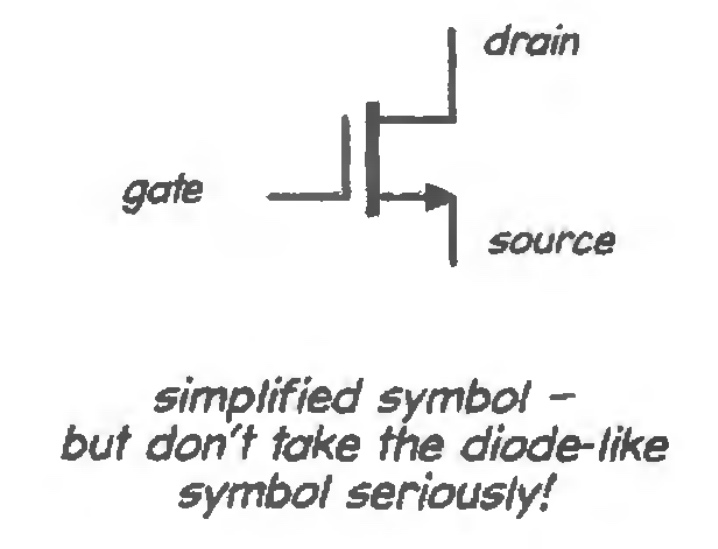 | 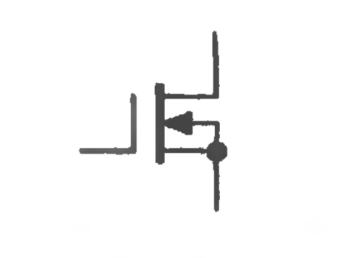 | 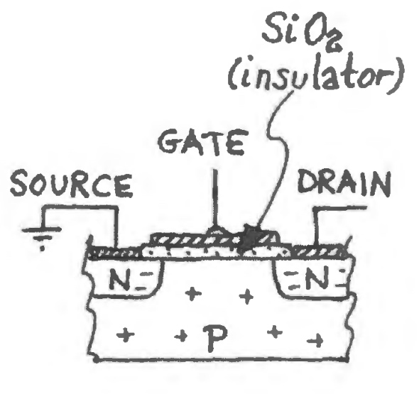                   |

In the schematic the space between the gate and the body is a $SiO_2$ insulator, which results in the high input impedance and stray capacitance (called gate capacitance). 

For an n-channel MOSFET the source and drain are N type and the body is P type. A positive charge on the gate allows current to flow from drain to source (electrons flow source to drain). The p-type body forms a diode with the channel and must never be forward biased. (the body of an n-channel FET must be at least as negative as the source which is more negative than the drain). 

> Often the body is tied to the lowest voltage (e.g. negative supply voltage) to prevent negative swings of input (gate) turning off or reversing the MOSFET. 

## Power Switching Circuit (vs BJT)
The most important issues when switching power are:
- how much power the switch dissipates when ON
- how easy/hard it is to drive

| BJT                                          | MOSFET                        | IGBT                                        |
| -------------------------------------------- | ----------------------------- | ------------------------------------------- |
| lowest $V_{ON,OUT}$ is det. by $V_{CE,sat.}$ | det. by $R_{ON}$              | better (lower) $R_{ON}$ for higher voltages |
| increases current as they heat               | reduces currents as they heat |                                             |
|                                              |                               |                                             |

Since [[MOSFETs are less adversely affected by temperature changes]] (read: they don't runaway with temperature), they can be paralleled easily. This allows us to switch higher loads (each MOSFET takes half the load current). ^7ckwmp

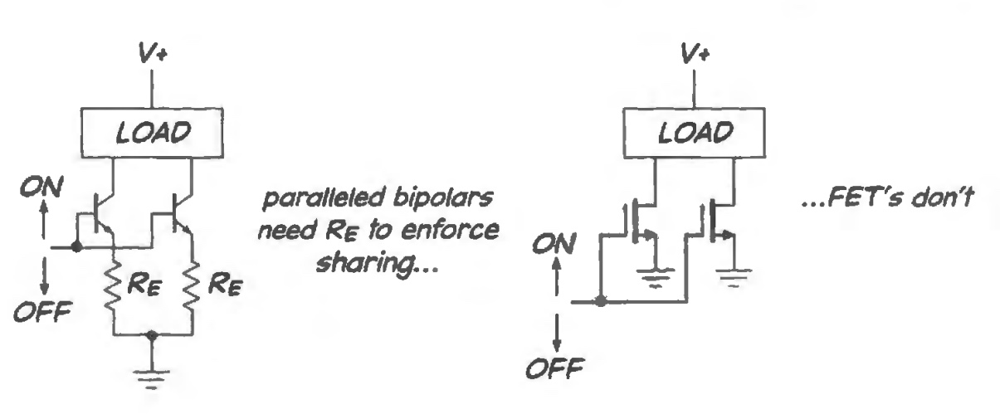

- [!] This paralleling only applies to power switching, not MOSFETs operating in the linear region (in the linear region MOSFETs pass more current as they heat - the same as bipolars)

### Input Capacitance Swings When Switching
- [[Gate capacitance can cause kink in output voltage during switching ]]
- $C_{gs}$ and $C_{ds}$ are big - 100s of pFs and feedback makes things even worse - $C_{gd}$ gets exagerrated by the quick swing of the drain as the device switches, the big $dV/dt$ causes a large current in $C_{gd}$; this appears as a hesistation or kink in the movement of voltage, esp. when provided a weak gate drive.

| Weak Gate Drive Circuit                           | Scope Results for Square Wave |
| ------------------------------------------ | ----------------------------- |
| 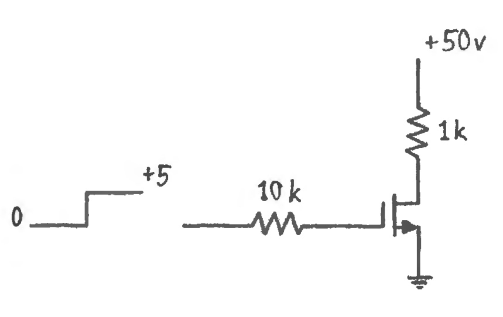 | 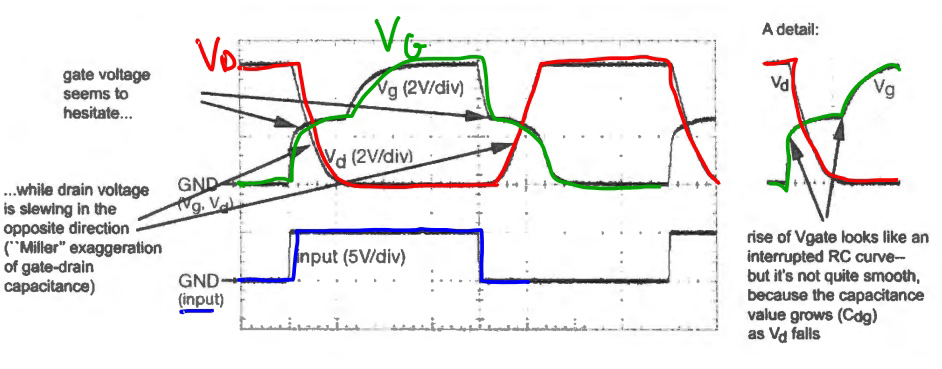                              |

> The exaggeration of $C_{gd}$ by the slewing of drain voltage in a direction opposite the movement of $V_{gd}$ is an instance of Miller Effect

## 12N.4 Power Switch Application - Audio Amplifier
- a switching regulator can approach 90% efficiency (vs. the 50% of a linear regulator)
- instead of the valve-like push-pull transistor of the [[Class AB amplifier]], the [[Class D amplifier]] uses ON/OFF MOSFET switching but generates switching noise

The switching noise, caused by the narrow and steep output pulses, appears on the input stream and can cause EMF interference with other components.

The outputs are full supply voltage swings (5V) which are filtered by the inductance of the speaker, allowing a _filterless_ thus cheaper design with high efficiency. 

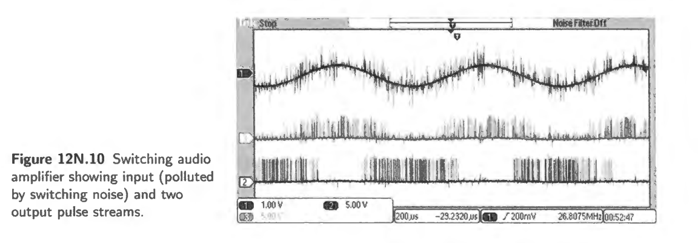

The output pulse stream is produced by _delta sigma modulation_ to achieve the correct average speaker current over many pulses. 

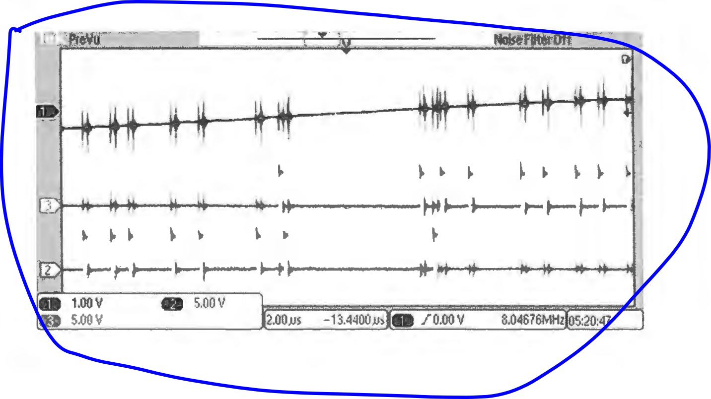

## 12N.5 - Logic Switches

In general the [[CMOS]] [[push-pull]] configuration is used for both logic and analog switches - allowing output voltage up to the full supply voltage.

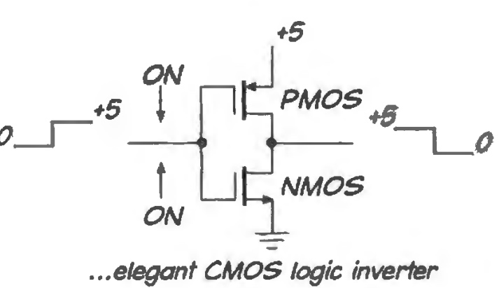

## 12N.5 - Analog Switches

The CMOS is used with an inverter to produce and efficient switch that can go up to the supply voltage and has low on resistance through the whole range of input.

Note here the body diode needs to be tied to the lowest (nMOS) or highest (pMOS) voltage to avoid back-conducting for ac signals. 

_Improved Analog Switch via CMOS:_
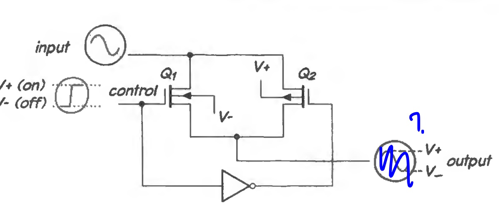

_Low on resistance through the whole signal:_
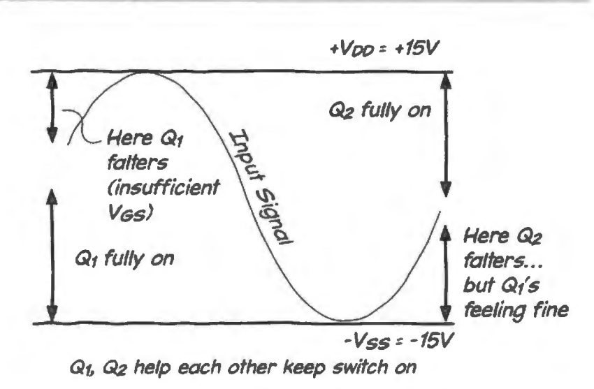

## 12S - Supplemental Notes 

🔴 ➡️ [[MOSFETs#Semiconductor View]]

> The MOSFET conducts when a positive voltage is applied to the gate which induces a layer of n-type (electron-rich) region ("channel") that links the drain and source n-regions.

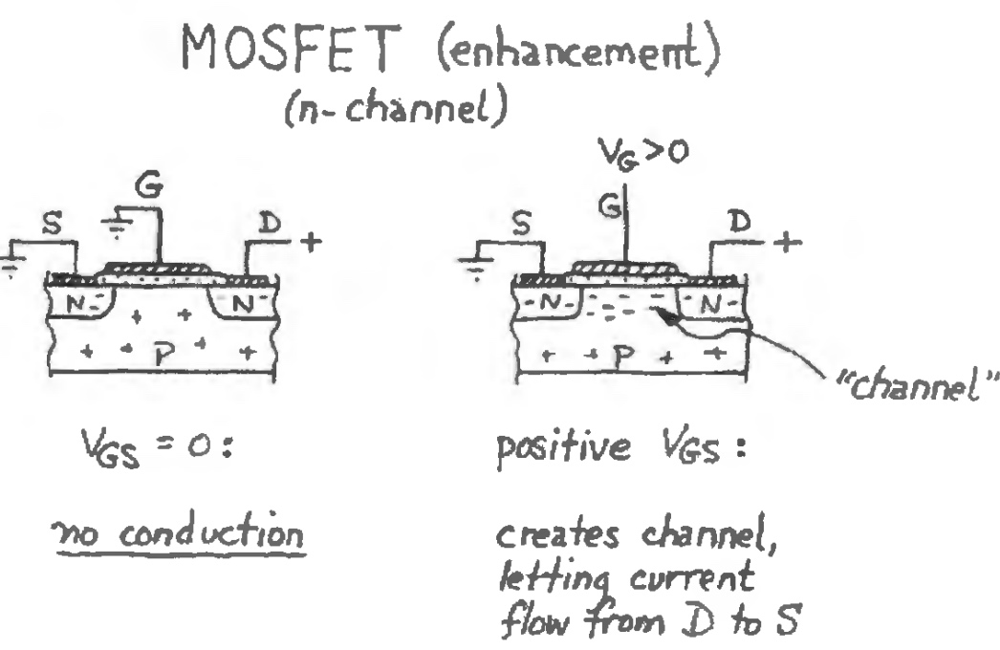

> As one gradually increases V_DS the rising voltage near the drain diminishes the width of the conducting region there and eventually the channel "pinches off" -- note that this does not stop conduction but rather results in saturation. 

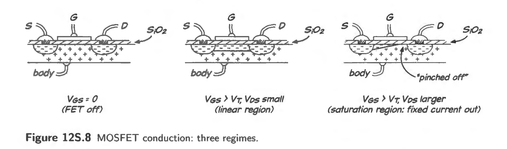

Here "saturation" in the FET since is different when applied to BJT or Op Amps - in this case the channel is "pinched off". If $V_{DS}$ continues to rise, $I_D$ levels off. **The field is still strong enough to carry electrons that have drifted through the channel on to the drain.** (More explanation in Burns 1987 § 5.2 and Jaeger 2011 § 4.24)

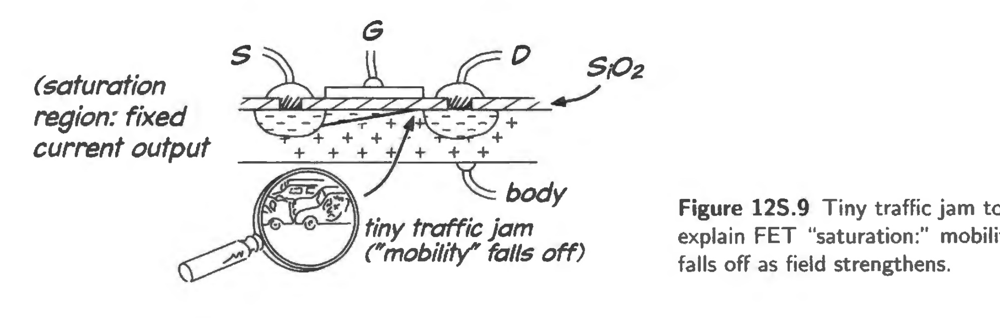

## 12N.6 - Applications

- Integrator Reset
- Multiplexer
- Switched Capacitor Filter ➡️ see [[12L MOSFETs]]
	- a digital low pass filter that is adjustable via the switched-cap mimicing a resistor
	- effective resistance is controlled by vaying the frequency of transfer between capacitors
- Sample and Hold ➡️ see [[12L MOSFETs]] , LAoE § 12N.7
	- useful for ADC
	- Design Criteria
		- large C makes it easy to _hold_ but hard to _sample_
		 - minimize _droop_ while holding due to leakage current
		 - charge injection due to FET matching imperfections when switching OFF, these FET switching signals are capacitively coupled to outputs delivering a net charge to the storage capacitor when it is supposed to turn OFF (smaller Cap = larger voltage step due to charge injection) ... ➡️ toward larger C designs
		 - feedthrough, the transmission of high freq. signals when OFF (➡️  toward larger Cap designs)

## Further

- AOE 3.1.3 for the effect of the drain terminal becoming more negative than the "source" 
- $R_{DS, ON}$ for MOSFET vs $V_{CE,sat}$ for BJT ➡️ [[MOSFET vs BJT]]
- Dyanmic gate current AOE § 3.2.8C
- FET switches AoE § 3.4 
- Switched Capacitor Filter AOE § 6.3.6

