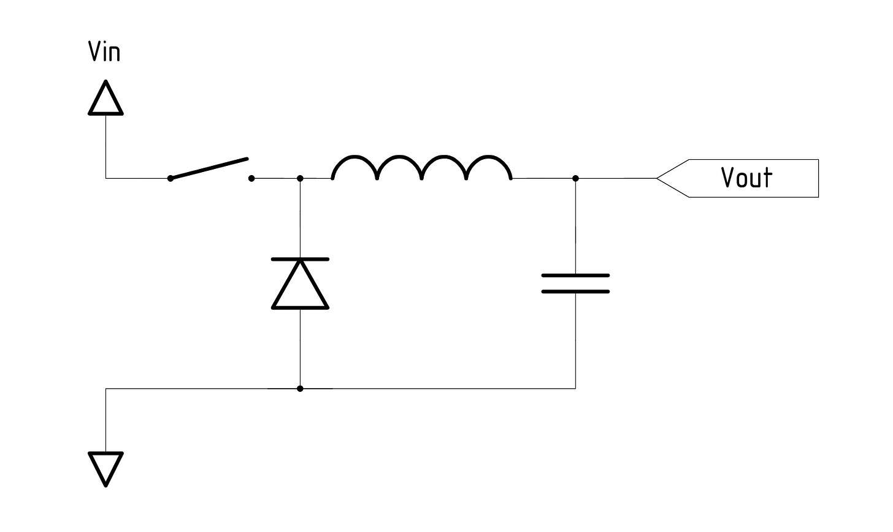

#n/anki

TARGET DECK
_Master::Eng::Electronics

To add
- [ ] MOSFETS
- [ ] power electronics

---

## Timer Registers

#anki-todo  calculate prescalers etc

## Basics, Voltage Dividers, etc

## Transistors - BJT

 #anki 
NPN Bipolar transistor
Turn on conditions:  
- positive base w.r.t emitter  
- positive base current  
Current flows collector → emitter  (top down)
"npn = never points in" → points out in direction of conventional current
 
<!--ID: 1707035080988-->

 #anki 
PNP Bipolar Transistor
Turn on conditions:  
- negative base w.r.t emitter  & negative base current
Current flows emitter → collector  (here bottom up)
Holes are majority carrier 

<!--ID: 1707036316551-->

 #anki 
PNP Bipolar with Emitter on top 
Conventional current flow is from top to bottom
Turn on conditions are base 0.7V below emitter & negative base current

<!--ID: 1707036316553-->

## Transistors - MOSFETs

### NMOS

 #anki 
NMOS (n-channel) MOSFET with body diode (enhancement mode)
- positive gate voltage turns ON  
- electrons are majority carriers   
- conv. current flows drain to source  
- drain drawn at top  
- since the FET semiconductor structure is inherently bidirectional, here a Drain-Source diode is included to prevent damage to the FET when reversed

<!--ID: 1707198772615-->

- [ ] TODO semiconductor view of NMOS
- semiconductor view: positive gate voltage pushes body holes away from gate forming an n-channel, source is kept negative wrt source, electrons flow source→drain, thus conv. current is drain → source

### PMOS

 #anki 
PMOS (p-channel) MOSFET with body diode (enhancement mode)
- negative gate voltage turns ON  
- hole carriers are majority  
- current flows Source → Drain  
- body diode points out  
- since the FET semiconductor structure is inherently bidirectional, here a Drain-Source diode is included to prevent damage to the FET when reversed

<!--ID: 1707198772618-->

TODO. 
NOTE- the body diode is to prevent damaging of the fet when reversed  
u

What's the difference between enhancement and depletion mode MOSFETs? #anki 
Enhancement mode means we need to apply voltage (enhance the channel) to "operate" the device. Depletion mode means we need to remove voltage (deplete the channel) to "turn off" the device. 
Enhancement mode NMOS: ON with 0 gate voltage, needs $V_{GS}>V_{TH}$ to turn ON
Depletion mode NMOS: ON with 0 gate voltage, needs negative $V_{GS}$ to turn OFF
<!--ID: 1707198772620-->

Describe the operation of a depletion mode n-channel MOSFET #anki 
It is a normally on switch (apply negative voltage to turn off)
Depletion mode means the device is already doped and will conduct for 0 gate voltage. 
We need to the deplete the channel to turn the device off, so a negative $V_{GS}$ must be applied.

<!--ID: 1707198772622-->

## Op Amps

## Power Electronics
[[DC-DC Converters]]
[[Buck Converter]]

Buck

- 

Boost

## Decibels

Power: $\frac{P_{out}}{P_{in}}\text{[dB]}=10 \log(\frac{P_{out}}{P_{in}})$ →  
Power output given attenuated dB and input #anki
$P_{out}=P_{in}\times10^{dB/10}$
<!--ID: 1707034339763-->

Voltage: $\frac{V_{out}}{V_{in}}\text{[dB]}=20 \log(\frac{V_{out}}{V_{in}})$ →  
Voltage output given attenuated dB and input #anki
$V_{out}=V_{in}\times10^{dB/20}$
<!--ID: 1707034339768-->

-3dB point is what ratio output to input (voltage) #anki 
- output is ~70% of input: $\frac{1}{\sqrt{2}}$ => -3dB
- $\frac{V_{out}}{V_{in}}=10^{-3\text{dB}/20} = 0.708$
<!--ID: 1707034339769-->

-6 dB is what ratio output/input (voltage) #anki 
- 50% => -6 dB
- $\frac{V_{out}}{V_{in}}=10^{-6\text{dB}/20} = 0.50118723$
<!--ID: 1707034339772-->

-20dB is what ratio output/input (amplitude/voltage) #anki 
- 10% => -20dB
<!--ID: 1707034339773-->

Each increase/decrease by a factor of 10 is an increase/decrease of #anki 
20dB
<!--ID: 1707035081014-->

